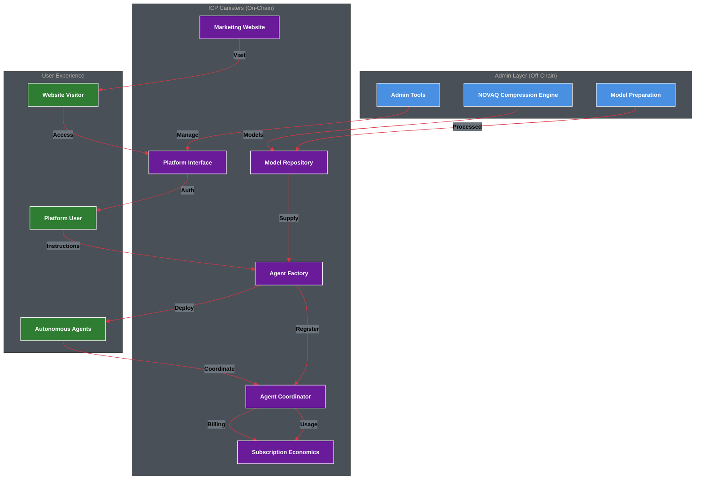
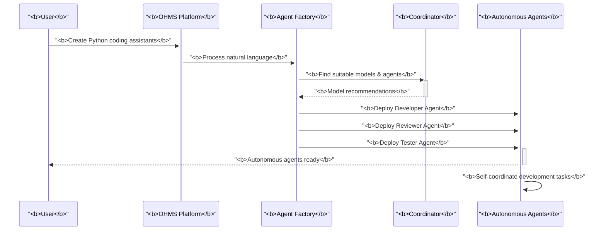
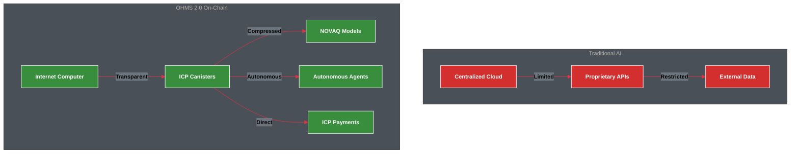
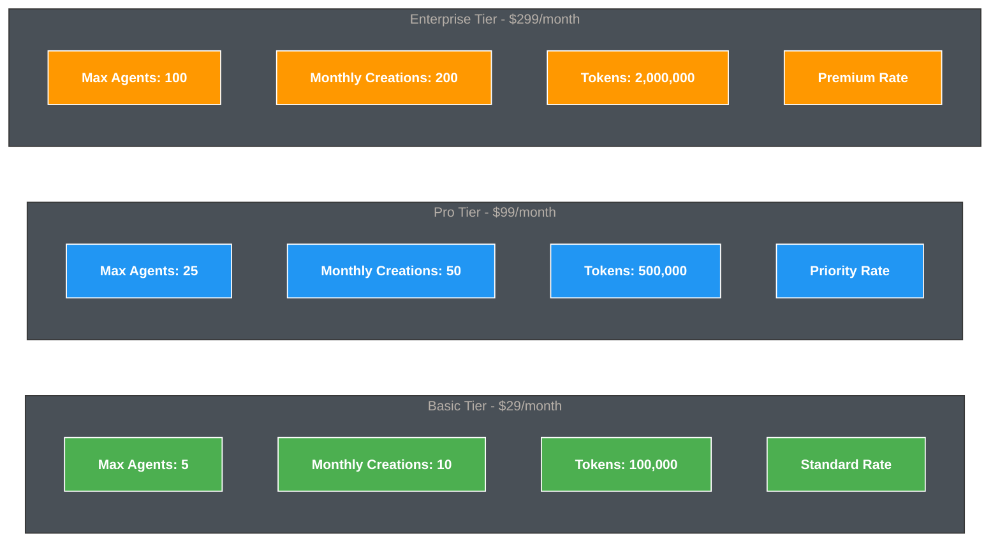
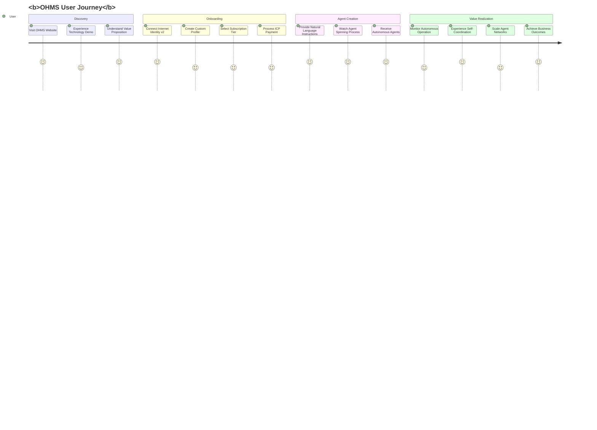
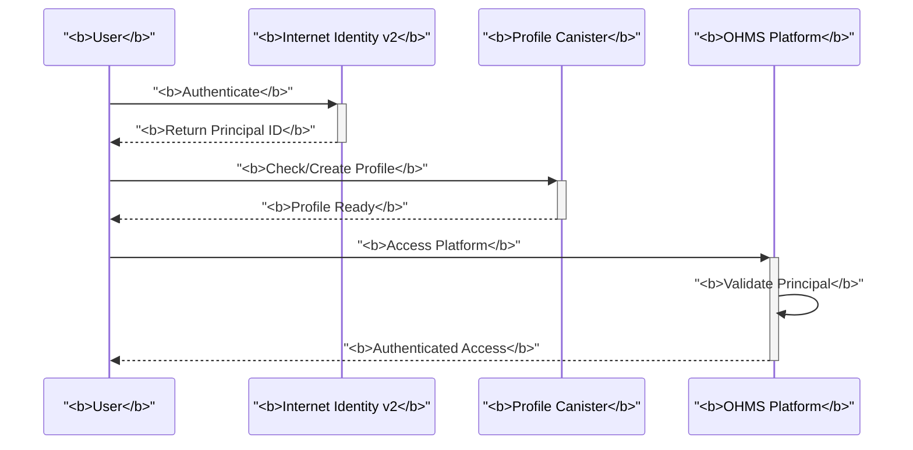

# OHMS 2.0 - Revolutionary Autonomous Agent Platform

[](https://github.com/OHMS-DeAI)
[](https://internetcomputer.org/)
[](https://rust-lang.org/)
[](https://reactjs.org/)
[](https://www.typescriptlang.org/)

**The world's first subscription-based autonomous agent platform where users create intelligent agents from natural language instructions, powered by NOVAQ compression and deployed entirely on the Internet Computer.**

## 🎯 Revolutionary Mission

Transform the AI agent landscape by enabling anyone to:
- **Create autonomous agents** from simple natural language instructions
- **Access revolutionary compression** technology (93-100x model size reduction)
- **Operate entirely on-chain** with complete transparency and security
- **Scale economically** through subscription-based tiers and quotas
- **Experience true autonomy** with self-coordinating multi-agent networks

## 🏗️ Complete Ecosystem Architecture



## 🌟 Key Innovations

### 1. Instruction-to-Agent Revolution


### 2. NOVAQ Compression Technology

```mermaid
%%{init: {'theme': 'base', 'themeVariables': {'primaryColor': '#f8f9fa', 'primaryTextColor': '#000000', 'primaryBorderColor': '#ffffff', 'lineColor': '#dc3545', 'lineWidth': '4px', 'sectionBkgColor': '#f8f9fa', 'altSectionBkgColor': '#e9ecef', 'secondaryColor': '#6c757d', 'tertiaryColor': '#495057', 'fontFamily': 'Arial', 'fontSize': '12px', 'fontWeight': 'bold'}}}%%
graph LR
    A["<b>Original Model<br/>15GB</b>"] --> B["<b>Distribution<br/>Normalization</b>"]
    B --> C["<b>Vector<br/>Codebooks</b>"]
    C --> D["<b>Teacher<br/>Refinement</b>"]
    D --> E["<b>NOVAQ Model<br/>150MB</b>"]
    E --> F["<b>93-100x<br/>Compression</b>"]
    F --> G["<b>>99% Quality<br/>Retention</b>"]

    classDef default fill:#f8f9fa,stroke:#ffffff,stroke-width:1px,color:#000000,font-weight:bold
    classDef input fill:#d32f2f,stroke:#ffffff,stroke-width:1px,color:#ffffff,font-weight:bold
    classDef process fill:#1976d2,stroke:#ffffff,stroke-width:1px,color:#ffffff,font-weight:bold
    classDef output fill:#388e3c,stroke:#ffffff,stroke-width:1px,color:#ffffff,font-weight:bold
    classDef result fill:#f57c00,stroke:#ffffff,stroke-width:1px,color:#ffffff,font-weight:bold
    
    class A input
    class B,C,D process
    class E output
    class F,G result
```


### 3. Complete On-Chain Architecture


## 📦 Complete Canister Ecosystem

### Production Canisters (Internet Computer Mainnet)

| Canister | Purpose | Canister ID | Direct URL | Candid UI |
|----------|---------|-------------|------------|-----------|
| **OHMS Agent** | Autonomous Agent Factory | `gavyi-uyaaa-aaaaa-qbu7q-cai` | [🔗](https://gavyi-uyaaa-aaaaa-qbu7q-cai.icp0.io/) | [🎛️](https://a4gq6-oaaaa-aaaab-qaa4q-cai.raw.icp0.io/?id=gavyi-uyaaa-aaaaa-qbu7q-cai) |
| **OHMS Coordinator** | Agent Orchestration Engine | `xp6tn-piaaa-aaaah-qqe4q-cai` | [🔗](https://xp6tn-piaaa-aaaah-qqe4q-cai.icp0.io/) | [🎛️](https://a4gq6-oaaaa-aaaab-qaa4q-cai.raw.icp0.io/?id=xp6tn-piaaa-aaaah-qqe4q-cai) |
| **OHMS Economics** | Subscription & Billing Engine | `tetse-piaaa-aaaao-qkeyq-cai` | [🔗](https://tetse-piaaa-aaaao-qkeyq-cai.icp0.io/) | [🎛️](https://a4gq6-oaaaa-aaaab-qaa4q-cai.raw.icp0.io/?id=tetse-piaaa-aaaao-qkeyq-cai) |
| **OHMS Model** | NOVAQ Model Repository | `3aes4-xyaaa-aaaal-qsryq-cai` | [🔗](https://3aes4-xyaaa-aaaal-qsryq-cai.icp0.io/) | [🎛️](https://a4gq6-oaaaa-aaaab-qaa4q-cai.raw.icp0.io/?id=3aes4-xyaaa-aaaal-qsryq-cai) |
| **OHMS UI** | Platform Interface | `xg5yr-zaaaa-aaaah-qqe5a-cai` | [🔗](https://xg5yr-zaaaa-aaaah-qqe5a-cai.icp0.io/) | [🎛️](https://a4gq6-oaaaa-aaaab-qaa4q-cai.raw.icp0.io/?id=xg5yr-zaaaa-aaaah-qqe5a-cai) |
| **OHMS Website** | Marketing Platform | `rjeaj-jyaaa-aaaau-abyka-cai` | [🔗](https://rjeaj-jyaaa-aaaau-abyka-cai.icp0.io/) | [🎛️](https://a4gq6-oaaaa-aaaab-qaa4q-cai.raw.icp0.io/?id=rjeaj-jyaaa-aaaau-abyka-cai) |

### Development Tools

| Component | Purpose | Technology | Location |
|-----------|---------|------------|----------|
| **NOVAQ Engine** | AI Model Compression | Rust CLI | `ohms-adaptq/` |
| **Admin Tools** | Platform Management | TypeScript | `ohms-ui/src/admin/` |
| **Development Scripts** | Build & Deployment | Bash | `scripts/` |

## 💰 Subscription Economics

### Transparent Pricing Tiers



### Economic Integration

```bash
# Check user subscription status
dfx canister --network ic call tetse-piaaa-aaaao-qkeyq-cai get_subscription '(
  principal "your-principal-id"
)'

# Get current usage and limits
dfx canister --network ic call tetse-piaaa-aaaao-qkeyq-cai get_usage_stats '(
  principal "your-principal-id"
)'

# Process subscription payment
dfx canister --network ic call tetse-piaaa-aaaao-qkeyq-cai process_payment '(
  record {
    user_principal = principal "your-principal-id";
    amount_icp = 580_000;  // $29 in ICP e8s
    payment_type = "subscription";
  }
)'
```

## 🚀 Revolutionary User Experience

### From Instructions to Autonomous Intelligence



### Agent Creation Examples

```bash
# Create coding assistants
dfx canister --network ic call gavyi-uyaaa-aaaaa-qbu7q-cai create_agents_from_instructions '(
  record {
    instructions = "Create Python development team with coding, testing, and documentation specialists";
    agent_count = 3;
    subscription_tier = "pro";
    user_principal = principal "your-principal-id";
  }
)'

# Create marketing agents
dfx canister --network ic call gavyi-uyaaa-aaaaa-qbu7q-cai create_agents_from_instructions '(
  record {
    instructions = "Build social media marketing team for e-commerce brand";
    agent_count = 5;
    subscription_tier = "enterprise";
    user_principal = principal "your-principal-id";
  }
)'

# Monitor agent performance
dfx canister --network ic call xp6tn-piaaa-aaaah-qqe4q-cai get_task_status '(
  record {
    task_id = "marketing-campaign-123";
    requester_principal = principal "your-principal-id";
  }
)'
```

## 🔧 NOVAQ Compression Technology

### Democratic Access to Advanced AI

```bash
# Compress any model with NOVAQ (completely open)
novaq hf meta-llama/Llama-3-8B --output llama3-8b-novaq.bin

# Validate compression quality
novaq validate llama3-8b-novaq.bin

# Get compression statistics
novaq stats llama3-8b-novaq.bin
```

### Performance Benchmarks

| Model | Original Size | NOVAQ Size | Compression | Quality | CPU Speedup |
|-------|---------------|------------|-------------|---------|-------------|
| LLaMA 3 8B | 15.0 GB | 150 MB | **100x** | >99% | 10.8x |
| Phi-3 Mini | 3.8 GB | 38 MB | **100x** | >99% | 12.1x |
| Mistral 7B | 13.5 GB | 140 MB | **96x** | >99% | 9.8x |
| Gemma 2 9B | 17.2 GB | 180 MB | **96x** | >99% | 9.2x |

## 🏛️ Governance & Security

### Principal-Based Authentication



### Multi-Layer Security

```mermaid
%%{init: {'theme': 'base', 'themeVariables': {'primaryColor': '#f8f9fa', 'primaryTextColor': '#000000', 'primaryBorderColor': '#ffffff', 'lineColor': '#dc3545', 'lineWidth': '4px', 'sectionBkgColor': '#f8f9fa', 'altSectionBkgColor': '#e9ecef', 'secondaryColor': '#6c757d', 'tertiaryColor': '#495057', 'fontFamily': 'Arial', 'fontSize': '12px', 'fontWeight': 'bold'}}}%%
graph TB
    subgraph "Authentication"
        IIv2["<b>Internet Identity v2</b>"]
        Principal["<b>Principal Validation</b>"]
        Profile["<b>Custom Profiles</b>"]
        Session["<b>Session Management</b>"]
    end

    subgraph "Authorization"
        Role["<b>Role-Based Access</b>"]
        Quota["<b>Quota Enforcement</b>"]
        RateLimit["<b>Rate Limiting</b>"]
        Audit["<b>Audit Logging</b>"]
    end

    subgraph "Data Protection"
        Encryption["<b>Data Encryption</b>"]
        Retention["<b>Retention Limits</b>"]
        Privacy["<b>Privacy Controls</b>"]
        Compliance["<b>Compliance Engine</b>"]
    end

    IIv2 -->|"<b>Verify</b>"| Principal
    Principal -->|"<b>Link</b>"| Profile
    Profile -->|"<b>Manage</b>"| Session

    Session -->|"<b>Authorize</b>"| Role
    Role -->|"<b>Enforce</b>"| Quota
    Quota -->|"<b>Limit</b>"| RateLimit
    RateLimit -->|"<b>Log</b>"| Audit

    Audit -->|"<b>Protect</b>"| Encryption
    Encryption -->|"<b>Control</b>"| Retention
    Retention -->|"<b>Ensure</b>"| Privacy
    Privacy -->|"<b>Comply</b>"| Compliance

    classDef default fill:#f8f9fa,stroke:#ffffff,stroke-width:1px,color:#000000,font-weight:bold
    classDef auth fill:#1976d2,stroke:#ffffff,stroke-width:1px,color:#ffffff,font-weight:bold
    classDef authz fill:#7b1fa2,stroke:#ffffff,stroke-width:1px,color:#ffffff,font-weight:bold
    classDef protection fill:#388e3c,stroke:#ffffff,stroke-width:1px,color:#ffffff,font-weight:bold
    
    class IIv2,Principal,Profile,Session auth
    class Role,Quota,RateLimit,Audit authz
    class Encryption,Retention,Privacy,Compliance protection
```



## 📊 Platform Performance

### Technical Metrics

| Component | Target | Status | Implementation |
|-----------|--------|--------|----------------|
| **Agent Creation** | <30 seconds | ✅ | Optimized instruction analysis |
| **Model Retrieval** | <2 seconds | ✅ | Lazy loading + caching |
| **Coordination** | <5 seconds | ✅ | Efficient agent discovery |
| **Compression** | 93-100x | ✅ | NOVAQ three-stage pipeline |
| **Uptime** | >99.9% | ✅ | ICP infrastructure |
| **Response Time** | <3 seconds | ✅ | Canister optimization |

### User Experience Metrics

| Metric | Target | Status | Focus |
|--------|--------|--------|-------|
| **User Acquisition** | 1000+ users | 🚧 | Marketing & onboarding |
| **User Retention** | >80% | 🚧 | Value realization |
| **Satisfaction** | >4.5/5 | 🚧 | Product experience |
| **Task Success** | >95% | ✅ | Agent capabilities |
| **Conversion Rate** | >5% | 🚧 | Sales funnel |

## 🚀 Quick Start Guide

### For New Users

1. **Visit OHMS Platform**: https://xg5yr-zaaaa-aaaah-qqe5a-cai.icp0.io/
2. **Authenticate**: Connect with Internet Identity v2
3. **Create Profile**: Set up your custom user profile
4. **Choose Subscription**: Select appropriate tier ($29-$299/month)
5. **Process Payment**: Complete ICP payment for subscription
6. **Create Agents**: Provide natural language instructions
7. **Monitor Performance**: Watch autonomous agents operate

### Monorepo Structure

OHMS 2.0 is organized as a monorepo with the following structure:

```
ohms-2.0/
├── ohms-adaptq/          # NOVAQ compression engine (Rust CLI)
├── ohms-agent/           # Agent factory canister (Rust)
├── ohms-coordinator/     # Agent orchestration canister (Rust)
├── ohms-econ/            # Economics & billing canister (Rust)
├── ohms-model/           # Model repository canister (Rust)
├── ohms-ui/              # Main platform interface (React/TypeScript)
├── ohms-website/         # Marketing website (Next.js)
├── docs/                 # Comprehensive documentation
├── scripts/              # Build and deployment scripts
├── dfx.json              # Unified canister configuration
├── Cargo.toml            # Rust workspace configuration
└── package.json          # Node.js workspace configuration
```

### For Developers

```bash
# Clone the complete monorepo
git clone https://github.com/OHMS-DeAI/ohms-2.0.git
cd ohms-2.0

# Install all dependencies (root + workspaces)
npm run install:all

# Start local ICP development
npm run dfx:start

# Deploy all canisters locally
npm run dfx:deploy:local

# Start the platform interface
npm run dev:ui

# Start the marketing website (separate terminal)
npm run dev:website

# Open platform at http://localhost:3000
# Open website at http://localhost:3001
```

### Monorepo Commands

```bash
# Install dependencies for all projects
npm run install:all

# Build all frontend projects
npm run build:all

# Run tests across all projects
npm run test:ui
npm run test:website

# DFX operations
npm run dfx:start          # Start local replica
npm run dfx:stop           # Stop local replica
npm run dfx:deploy:local   # Deploy to local network
npm run dfx:deploy:ic      # Deploy to mainnet
npm run canister:status    # Check canister status
```

### For Model Contributors

```bash
# Install NOVAQ CLI
cargo install --git https://github.com/OHMS-DeAI/ohms-adaptq.git

# Compress your model
novaq hf your-model-name --output compressed-model.bin

# Submit to OHMS platform (after authentication)
novaq submit-to-ohms compressed-model.bin --platform-url https://xg5yr-zaaaa-aaaah-qqe5a-cai.icp0.io
```

## 📚 Comprehensive Documentation

### Core Documentation
- **[OHMS Master Plan](./docs/OHMS-MASTER-PLAN.md)** - Complete development roadmap
- **[Product Requirements](./docs/ohms-2.0-prd.md)** - Detailed product specifications
- **[Technical Architecture](./docs/ohms-fullstack-architecture.md)** - Complete system architecture
- **[System Diagrams](./docs/system-architecture-diagrams.md)** - Visual architecture flows

### Technical Documentation
- **[Repository Guidelines](./AGENTS.md)** - Contributor workflow and standards
- **[NOVAQ Technology](./docs/novaq.md)** - Compression engine documentation
- **[Authentication Architecture](./docs/principal-authentication-architecture.md)** - II v2 integration
- **[User Profile System](./docs/user-profile-system-specification.md)** - Profile management
- **[Admin-User Separation](./docs/admin-user-separation-plan.md)** - Platform governance

### Canister Documentation
- **[OHMS Agent](./ohms-agent/README.md)** - Agent factory documentation
- **[OHMS Coordinator](./ohms-coordinator/README.md)** - Orchestration engine docs
- **[OHMS Economics](./ohms-econ/README.md)** - Subscription & billing
- **[OHMS Model](./ohms-model/README.md)** - Model repository guide
- **[OHMS UI](./ohms-ui/README.md)** - Platform interface docs
- **[OHMS Website](./ohms-website/README.md)** - Marketing site docs
- **[NOVAQ Engine](./ohms-adaptq/README.md)** - Compression CLI docs

## 🏆 Competitive Advantages

### Revolutionary Features
1. **Instruction-to-Agent Creation**: First platform converting natural language to autonomous agents
2. **NOVAQ Compression**: 93-100x model compression with quality preservation
3. **Complete On-Chain**: Full transparency and verifiable execution on ICP
4. **Subscription Economics**: Sustainable business model with transparent pricing
5. **Self-Coordinating Agents**: Multi-agent networks requiring minimal intervention

### Technical Superiority
1. **Internet Computer Native**: Leveraging ICP's infinite scalability and security
2. **Democratic Technology**: Open NOVAQ access while maintaining platform quality
3. **Real Principal Authentication**: Secure II v2 integration without external dependencies
4. **Performance Optimized**: Sub-second response times with efficient architecture
5. **Enterprise Ready**: Governance, compliance, and enterprise-grade security

## 🎯 Success Vision

### Immediate Goals (Months 1-3)
- **User Acquisition**: 1000+ active users on the platform
- **Agent Creation**: 10,000+ autonomous agents deployed
- **Revenue Generation**: $50,000+ monthly recurring revenue
- **Technical Performance**: >99.9% platform uptime and reliability
- **User Satisfaction**: >4.5/5 rating across all metrics

### Long-term Vision (Year 1)
- **Market Leadership**: Become the #1 autonomous agent platform
- **Ecosystem Growth**: 50,000+ active users and 100,000+ agents
- **Revenue Scale**: $2M+ monthly recurring revenue
- **Technology Advancement**: Push boundaries of on-chain AI capabilities
- **Global Impact**: Democratize access to advanced AI technology worldwide

## 📞 Contact & Community

### Project Leadership
- **Project Lead**: Dedan Okware
- **Email**: softengdedan@gmail.com
- **Focus**: Revolutionary autonomous agent platform with subscription economics

### Community Channels
- **Website**: https://rjeaj-jyaaa-aaaau-abyka-cai.icp0.io/
- **Platform**: https://xg5yr-zaaaa-aaaah-qqe5a-cai.icp0.io/
- **Documentation**: https://docs.ohms.ai/
- **GitHub**: https://github.com/OHMS-DeAI/
- **Discord**: https://discord.gg/ohms

### Technical Support
- **Candid UI**: Interactive canister testing for all components
- **Direct URLs**: Access all canisters directly on mainnet
- **Documentation**: Comprehensive guides and API references
- **Community Forum**: Peer support and knowledge sharing

---

## 🌟 The OHMS Revolution

OHMS 2.0 represents a fundamental shift in how AI agents are created, deployed, and managed. By combining revolutionary NOVAQ compression technology with instruction-based agent creation, complete on-chain transparency, and subscription-based economics, we're building the foundation for the future of autonomous AI.

**Join the revolution. Transform natural language into autonomous intelligence.**

---

> **"From instructions to autonomous intelligence: The future of AI agent platforms."**

**🚀 OHMS 2.0: Where revolutionary technology meets practical economics.**
