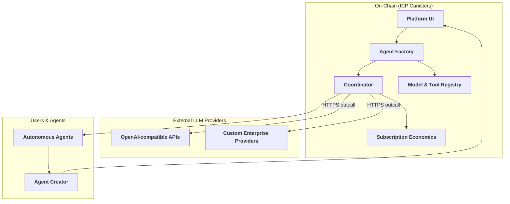
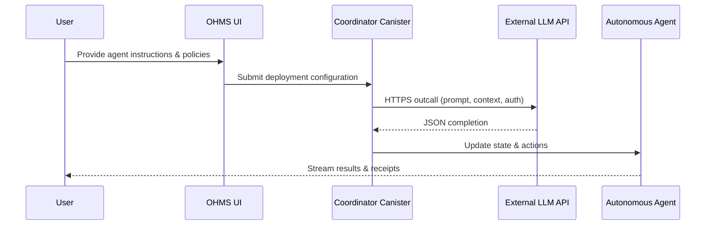

# OHMS 2.0 – Autonomous Agent Platform on the Internet Computer

[](https://github.com/OHMS-DeAI)
[](https://internetcomputer.org/)
[](https://rust-lang.org/)
[](https://reactjs.org/)
[](https://www.typescriptlang.org/)

**Subscription-based AI agent platform that turns natural language instructions into autonomous agents, orchestrated entirely on-chain and powered by Internet Computer HTTPS outcalls to external LLM providers.**

## 🎯 Mission
- Enable anyone to compose powerful AI agents from plain-language goals.
- Deliver verifiable, on-chain execution with transparent economics.
- Bridge decentralized coordination with best-in-class hosted LLMs via secure HTTPS outcalls.
- Support multi-agent collaborations that can plan, act, and report autonomously.

## 🏗️ Platform Architecture



## 🌟 Core Capabilities
1. **Instruction-to-Agent Pipeline** – Translate natural language into deployable agent graphs with configurable prompts, tools, and policies.
2. **LLM Outcall Mesh** – Invoke external LLM endpoints directly from canisters using hardened HTTP outcalls, enabling bring-your-own provider strategies.
3. **On-Chain Coordination** – Persist agent state, task assignments, and receipts with ICP guarantees for auditability and trust.
4. **Subscription Economics** – Meter usage, enforce quotas, and manage billing tiers natively on-chain.
5. **Composable Tooling** – Share reusable prompts, workflows, and plugins across agents through the registry.

## 🔌 LLM Outcall Flow



## 🧱 Component Overview
- `ohms-agent/` – Rust canister that instantiates task-specific agents, manages their lifecycle, and exposes APIs for the UI.
- `ohms-coordinator/` – Orchestrates multi-agent workflows, issues HTTPS outcalls via `HttpOutcallService`, and reconciles billing events.
- `ohms-model/` – Stores model metadata, prompt templates, and tool definitions available to the factory.
- `ohms-econ/` – Tracks subscriptions, usage quotas, and settlements across the platform.
- `ohms-queen-agent/` – Domain agents that coordinate specialized worker collectives.
- `ohms-shared/` – Shared types, communication channels, and HTTP outcall client bindings.
- `ohms-ui/` – React + TypeScript interface for building, testing, and monitoring agents.
- `ohms-website/` – Marketing site and onboarding funnel for new users.
- `shared-types/` – TypeScript definitions consumed by front-end and external integrations.

## 🚀 Getting Started

### Prerequisites
- Rust 1.70+
- Node.js 20+
- `dfx` 0.17+
- npm (or your preferred package manager)

### Quickstart
```bash
# Install dependencies
npm install

# Start local replica, canisters, and front-end (helper script)
./scripts/dev-all.sh
```

### Manual Workflow
```bash
# Start a local Internet Computer replica
dfx start --background

# Deploy canisters locally
dfx deploy

# Bootstrap front-end workspaces
npm run install:ui
npm run install:website

# Launch development servers
npm run dev:ui
npm run dev:website
```

### Useful Commands
```bash
# Format and lint Rust
cargo fmt
cargo clippy

# TypeScript linting & formatting
npm run lint:ui
npm run lint:website

# Run automated tests
cargo test --all
npm run test:ui
npm run test:website
```

## 📚 Documentation Highlights
- `docs/OHMS-MASTER-PLAN.md` – Strategic roadmap and milestones.
- `docs/ohms-2.0-prd.md` – Product requirements and user journeys.
- `docs/system-architecture-diagrams.md` – Reference diagrams for coordinators, agents, and UI flows.
- `docs/prompts.md` – Prompt engineering guidelines and reusable templates.
- `docs/Milestones/` – Sprint-by-sprint execution plans.
- `ohms-agent/README.md` – Agent factory implementation details.
- `ohms-coordinator/README.md` – Coordinator APIs and outcall configuration.
- `ohms-ui/README.md` – Front-end setup & deployment.
- `scripts/` – Helper scripts for building, testing, and deploying the full stack.

## 🏆 Why OHMS 2.0
- **On-chain trust** – Deterministic canisters provide tamper-evident agent execution.
- **Provider flexibility** – Operators select the LLM endpoints that meet their SLA and compliance needs.
- **Collaborative agents** – Coordinated worker cohorts tackle complex tasks with minimal human intervention.
- **Usage transparency** – Receipts, quotas, and billing live on-chain for instant auditability.
- **Extensible design** – Shared registry enables new tools, prompts, and workflows without redeploying core canisters.

## 🤝 Contributing
1. Fork the repository and create a feature branch.
2. Make your changes with tests or receipts demonstrating the impact.
3. Ensure `cargo fmt`, `cargo clippy`, and relevant `npm run lint` checks pass.
4. Open a pull request describing the change and associated milestones.

## 📞 Contact & Community
- **Project Lead**: Dedan Okware – softengdedan@gmail.com
- **Website**: https://weamn-piaaa-aaaah-arlca-cai.icp0.io/
- **Platform**: https://wrh5a-oaaaa-aaaah-arlbq-cai.icp0.io/
- **Docs**: https://docs.ohms.ai/
- **GitHub**: https://github.com/OHMS-DeAI/
- **Discord**: https://discord.gg/ohms

---

**Turn natural language into autonomous intelligence. Harness verified on-chain coordination with the flexibility of modern LLM outcalls.**
