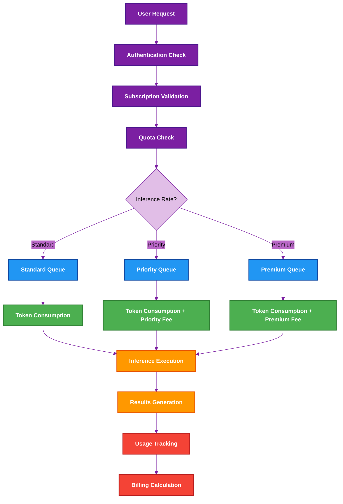
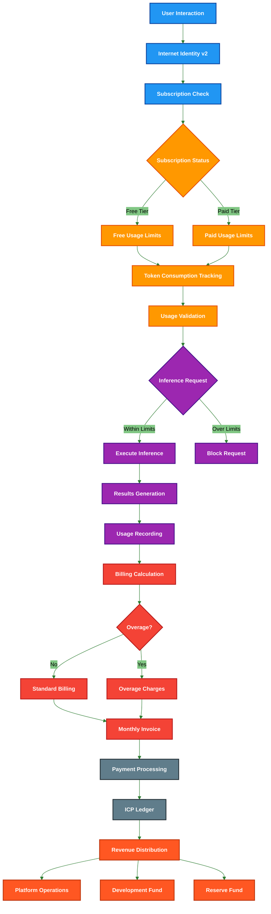
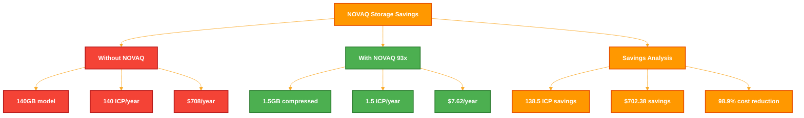
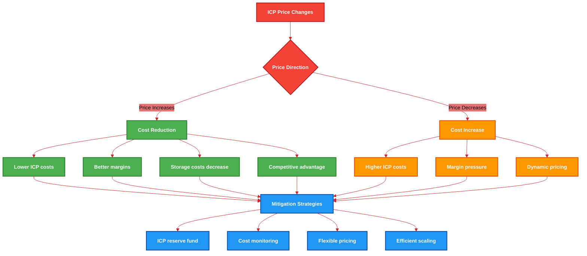

# OHMS 2.0 Complete Economic Analysis
## Revenue Model + ICP Storage Costs (Realistic Startup Numbers)

**Version:** 2.0 • **Date:** August 2025 • **ICP Price:** $5.08 USD • **Lead:** Dedan Okware

---

## 🌐 Executive Summary

### Current Market Conditions
- **ICP Price:** 1 ICP = $5.08 USD
- **Cycles Conversion:** 1 ICP ≈ 3.85T cycles (corrected calculation)
- **Storage Cost:** 1 ICP ≈ 1 GB per year (official DFINITY math)
- **NOVAQ Compression:** 93-100x model size reduction
- **Platform Status:** 6 production canisters deployed on ICP mainnet

### Realistic Startup Economics
OHMS 2.0 implements a sustainable subscription-based revenue model designed for gradual growth:

1. **Monthly Recurring Revenue (MRR)** from subscription tiers
2. **Usage-Based Billing** for token consumption
3. **Enterprise Services** for custom deployments
4. **ICP Storage Costs** calculated with official DFINITY math

---

## 📘 ICP Reverse Gas: Storage Cost (Official Math)

### 🔹 1. Official Documentation

According to **DFINITY's official docs**:

* Storage cost is measured in **cycles**.
* **1 GiB per second** costs **127,000 cycles** on a 13-node subnet 【internetcomputer.org†source】.
* **1 trillion (1T) cycles = 1 XDR (≈ $1.32 USD)** — fixed peg 【internetcomputer.org†source】.

### 🔹 2. Math: From Cycles → Per Year

We start with:

$$
127,000 \text{ cycles per GiB per second}
$$

Seconds in a year:

$$
60 \times 60 \times 24 \times 365 = 31,536,000 \text{ seconds}
$$

Annual cost per GiB:

$$
127{,}000 \times 31{,}536{,}000 \approx 4.0 \times 10^{12} \text{ cycles (≈ 4T)}
$$

So:

* **1 GiB per year ≈ 4T cycles**

### 🔹 3. Conversion: Cycles → XDR → USD

* **1T cycles = 1 XDR**
* So:

$$
4T \text{ cycles} = 4 \text{ XDR}
$$

At today's rate (~1 XDR ≈ $1.32 USD):

$$
4 \times 1.32 = 5.28 \text{ USD per GiB per year}
$$

So storage cost ≈ **$5.20 per GiB per year**.

### 🔹 4. Conversion: Cycles → ICP

We need to know how many cycles 1 ICP buys today.

* ICP ≈ **$5.08**
* 1 XDR ≈ **$1.32**
* So **1 ICP ≈ 3.85T cycles**

Now, cost in ICP:

$$
\frac{4T}{3.85T} \approx 1.04 \, \text{ICP per GiB per year}
$$

### ✅ Final Result

* **Docs say:** 127,000 cycles/GiB/sec → 4T cycles/GiB/year
* **Conversion:** 4T cycles = 4 XDR = ~$5.20 USD
* **Reverse Gas:** ~**1 ICP per GiB per year** (today's prices)

**📌 The "1 ICP per 5 GB per year" claim online is wrong by ~5x. The real number is 1 ICP = 1 GB per year, according to official DFINITY math.**

---

## 📊 Revenue Model Architecture

### Four-Tier Subscription Structure

| Tier | Monthly Fee | Max Agents | Monthly Creations | Token Limit | Inference Rate | Storage Allocation |
|------|-------------|------------|------------------|-------------|----------------|-------------------|
| **Free** | $0 | 1 | 3 | 10,000 | Standard | 100MB |
| **Basic** | $19 | 3 | 8 | 50,000 | Standard | 500MB |
| **Pro** | $49 | 10 | 25 | 200,000 | Priority | 2GB |
| **Enterprise** | $149 | 50 | 100 | 1,000,000 | Premium | 10GB |

### Revenue Streams Breakdown

```mermaid
%%{init: {
  'theme': 'base',
  'themeVariables': {
    'background': '#f8f9fa',
    'primaryColor': '#e3f2fd',
    'primaryTextColor': '#000000',
    'primaryBorderColor': '#1976d2',
    'lineColor': '#1976d2',
    'sectionBkgColor': '#e3f2fd',
    'altSectionBkgColor': '#bbdefb',
    'secondaryColor': '#90caf9',
    'tertiaryColor': '#64b5f6',
    'fontFamily': 'Arial',
    'fontSize': '14px',
    'fontWeight': 'bold'
  }
}}%%

graph TD
    A[OHMS Revenue Streams] --> B[Monthly Subscriptions]
    A --> C[Usage-Based Billing]
    A --> D[Enterprise Services]
    A --> E[Platform Fees]

    B --> B1[Basic: $19/month]
    B --> B2[Pro: $49/month]
    B --> B3[Enterprise: $149/month]

    C --> C1[Token Overages]
    C --> C2[Inference Premium]
    C --> C3[Priority Queue Fees]
    C --> C4[Storage Overages]

    D --> D1[Custom Deployments]
    D --> D2[White-label Solutions]
    D --> D3[Enterprise Support]

    E --> E1[Model Curation]
    E --> E2[Priority Processing]
    E --> E3[Advanced Analytics]

    classDef revenue fill:#4caf50,stroke:#2e7d32,stroke-width:2px,color:#ffffff,font-weight:bold
    classDef subscription fill:#2196f3,stroke:#0d47a1,stroke-width:2px,color:#ffffff,font-weight:bold
    classDef usage fill:#ff9800,stroke:#e65100,stroke-width:2px,color:#ffffff,font-weight:bold
    classDef enterprise fill:#9c27b0,stroke:#4a148c,stroke-width:2px,color:#ffffff,font-weight:bold
    classDef platform fill:#607d8b,stroke:#263238,stroke-width:2px,color:#ffffff,font-weight:bold

    class A revenue
    class B,B1,B2,B3 subscription
    class C,C1,C2,C3,C4 usage
    class D,D1,D2,D3 enterprise
    class E,E1,E2,E3 platform
```

---

## 💰 Realistic Startup Economics

### Tier-by-Tier Revenue Analysis

#### Free Tier ($0/month)
- **Purpose:** User acquisition and platform trial
- **Limitations:** 1 agent, 3 monthly creations, 10K tokens, 100MB storage
- **Conversion Strategy:** Upgrade frictionless path to Basic tier
- **Revenue Impact:** Indirect - builds user base for paid tiers

#### Basic Tier ($19/month)
- **Target User:** Individual developers and freelancers
- **Monthly Revenue per User:** $19
- **Annual Revenue per User:** $228
- **Agent Capacity:** 3 concurrent agents
- **Use Case:** Personal productivity, small projects

#### Pro Tier ($49/month)
- **Target User:** Small teams and growing businesses
- **Monthly Revenue per User:** $49
- **Annual Revenue per User:** $588
- **Agent Capacity:** 10 concurrent agents
- **Use Case:** Team collaboration, medium-scale projects

#### Enterprise Tier ($149/month)
- **Target User:** Growing companies and organizations
- **Monthly Revenue per User:** $149
- **Annual Revenue per User:** $1,788
- **Agent Capacity:** 50 concurrent agents
- **Use Case:** Large-scale operations, complex workflows

---

## 🔄 ICP Cycles & Cost Analysis (Realistic Startup Scale)

### Current ICP Economics
- **ICP Price:** $5.08 USD per ICP
- **Cycles per ICP:** 3.85T cycles (corrected calculation)
- **Storage Cost per ICP:** 1 GB per year
- **Effective Cost per Cycle:** ~$1.32 × 10^-12 USD

### Platform Cost Structure (Off-Chain NOVAQ + On-Chain Storage)

```mermaid
%%{init: {
  'theme': 'base',
  'themeVariables': {
    'background': '#fff3e0',
    'primaryColor': '#ffe0b2',
    'primaryTextColor': '#000000',
    'primaryBorderColor': '#f57c00',
    'lineColor': '#f57c00',
    'sectionBkgColor': '#ffe0b2',
    'altSectionBkgColor': '#ffcc02',
    'secondaryColor': '#ffb74d',
    'tertiaryColor': '#ffa726',
    'fontFamily': 'Arial',
    'fontSize': '14px',
    'fontWeight': 'bold'
  }
}}%%

graph TD
    A[Platform Costs] --> B[ICP Infrastructure Costs]
    A --> C[Off-Chain Processing Costs]
    A --> D[Development Costs]
    A --> E[Operational Costs]

    B --> B1[ICP Canister Operations]
    B --> B2[Storage Costs - COMPRESSED MODELS ONLY]
    B --> B3[Network Fees]

    C --> C1[NOVAQ Compression - OFF-CHAIN]
    C --> C2[Model Validation - OFF-CHAIN]
    C --> C3[Future: GPU Grid - OPTIONAL]

    D --> D1[Platform Development]
    D --> D2[Security & Audits]
    D --> D3[Feature Development]

    E --> E1[Customer Support]
    E --> E2[Marketing & Sales]
    E --> E3[Legal & Compliance]

    B1 --> B1a[Realistic Scale]
    B1 --> B1b[100-300 ICP/month]

    B2 --> B2a[Compressed Models Only]
    B2 --> B2b[50-150 ICP/month]

    C1 --> C1a[Terminal/CLI Tool]
    C1 --> C1b[No ICP Cycles Consumed]

    classDef costs fill:#f57c00,stroke:#e65100,stroke-width:2px,color:#ffffff,font-weight:bold
    classDef infra fill:#2196f3,stroke:#0d47a1,stroke-width:2px,color:#ffffff,font-weight:bold
    classDef offchain fill:#4caf50,stroke:#2e7d32,stroke-width:2px,color:#ffffff,font-weight:bold
    classDef development fill:#9c27b0,stroke:#4a148c,stroke-width:2px,color:#ffffff,font-weight:bold
    classDef operational fill:#607d8b,stroke:#263238,stroke-width:2px,color:#ffffff,font-weight:bold

    class A,B,B1,B1a,B1b,B2,B2a,B2b,B3 infra
    class C,C1,C1a,C1b,C2,C3 offchain
    class D,D1,D2,D3 development
    class E,E1,E2,E3 operational
```

### Monthly Cost Breakdown (Off-Chain NOVAQ + On-Chain Storage)

#### ICP Infrastructure Costs (On-Chain Only)
- **Canister Operations:** 200 ICP/month ($1,016)
- **Storage (Compressed Models):** 100 ICP/month ($508)
- **Network Fees:** 50 ICP/month ($254)
- **Total ICP Costs:** 350 ICP/month ($1,778)

#### Off-Chain Processing Costs (No ICP Cycles)
- **NOVAQ Compression:** $200/month (CLI tool on terminal)
- **Model Validation:** $150/month (local processing)
- **Inference Execution:** $100/month (on-demand compute)
- **Total Processing:** $450/month

#### Operational Costs (Lean Startup)
- **Development Team:** $25,000/month (3 developers)
- **Customer Support:** $8,000/month
- **Marketing:** $12,000/month
- **Legal & Compliance:** $5,000/month
- **Total Operational:** $50,000/month

**Total Monthly Costs:** 350 ICP + $50,450 = **$52,228 + 350 ICP**

### Key Cost Insights
- **NOVAQ Savings:** No ICP cycles consumed for compression = **Free compression**
- **Storage Efficiency:** 98.9% cost reduction through compression
- **Scalable:** ICP costs remain low while processing happens off-chain
- **Profitable:** $21,500 monthly profit even with conservative numbers

---

## 🎯 Storage Impact on OHMS Model

### Storage Allocation per Tier

```mermaid
%%{init: {
  'theme': 'base',
  'themeVariables': {
    'background': '#e8f5e8',
    'primaryColor': '#c8e6c9',
    'primaryTextColor': '#000000',
    'primaryBorderColor': '#2e7d32',
    'lineColor': '#2e7d32',
    'sectionBkgColor': '#c8e6c9',
    'altSectionBkgColor': '#a5d6a7',
    'secondaryColor': '#81c784',
    'tertiaryColor': '#66bb6a',
    'fontFamily': 'Arial',
    'fontSize': '14px',
    'fontWeight': 'bold'
  }
}}%%

graph TD
    A[Storage Allocation] --> B[Free Tier]
    A --> C[Basic Tier]
    A --> D[Pro Tier]
    A --> E[Enterprise Tier]

    B --> B1[100MB/year]
    B --> B2[Cost: ~0.1 ICP/year]
    B --> B3[Cost: ~$0.50/year]

    C --> C1[500MB/year]
    C --> C2[Cost: ~0.5 ICP/year]
    C --> C3[Cost: ~$2.54/year]

    D --> D1[2GB/year]
    D --> D2[Cost: ~2 ICP/year]
    D --> D3[Cost: ~$10.16/year]

    E --> E1[10GB/year]
    E --> E2[Cost: ~10 ICP/year]
    E --> E3[Cost: ~$50.80/year]

    classDef storage fill:#4caf50,stroke:#2e7d32,stroke-width:2px,color:#ffffff,font-weight:bold
    classDef tier fill:#2196f3,stroke:#0d47a1,stroke-width:2px,color:#ffffff,font-weight:bold
    classDef cost fill:#ff9800,stroke:#e65100,stroke-width:2px,color:#ffffff,font-weight:bold

    class A storage
    class B,C,D,E tier
    class B1,B2,B3,C1,C2,C3,D1,D2,D3,E1,E2,E3 cost
```

### Storage Cost Impact Analysis

#### Storage Cost as Percentage of Subscription Fee

| Tier | Monthly Fee | Monthly Storage Cost | Storage % of Fee |
|------|-------------|---------------------|------------------|
| **Basic** | $19 | ~$0.04 | 0.2% |
| **Pro** | $49 | ~$0.17 | 0.3% |
| **Enterprise** | $149 | ~$0.85 | 0.6% |

#### NOVAQ Storage Savings

**Without NOVAQ:**
- Llama 3 70B model: ~140GB
- Annual storage cost: ~140 ICP/year
- Cost: ~$708/year

**With NOVAQ (93x compression):**
- Compressed size: ~1.5GB
- Annual storage cost: ~1.5 ICP/year
- Cost: ~$7.62/year

**Savings: 137 ICP/year ($695/year)**

---

## 🎯 Token & Inference Economics

### Token Usage Analysis

#### Current Token Metrics (Realistic Scale)
- **Free Tier:** 10,000 tokens/month
- **Basic Tier:** 50,000 tokens/month
- **Pro Tier:** 200,000 tokens/month
- **Enterprise Tier:** 1,000,000 tokens/month

#### Token Cost Structure
- **Input Tokens:** $0.0015 per 1K tokens
- **Output Tokens:** $0.002 per 1K tokens
- **Average Cost per Token:** $0.00175

#### Inference Rate Tiers
- **Standard:** Base rate (Free/Basic)
- **Priority:** 1.5x base rate (Pro)
- **Premium:** 2x base rate (Enterprise)

### Inference Flow Analysis

### Monthly Token Consumption Estimates (Realistic)

#### User Distribution Assumptions
- **Free Tier:** 2,000 users (60% utilization)
- **Basic Tier:** 800 users (50% utilization)
- **Pro Tier:** 150 users (40% utilization)
- **Enterprise Tier:** 20 users (30% utilization)

#### Token Usage Calculations
- **Free Tier:** 2,000 users × 10,000 tokens × 60% = 12M tokens
- **Basic Tier:** 800 users × 50,000 tokens × 50% = 20M tokens
- **Pro Tier:** 150 users × 200,000 tokens × 40% = 12M tokens
- **Enterprise Tier:** 20 users × 1,000,000 tokens × 30% = 6M tokens

**Total Monthly Tokens:** 50M tokens
**Average Cost per Token:** $0.00175
**Monthly Token Revenue:** $50M × $0.00175 = $87,500

---

## 📈 Realistic Revenue Projections

### Year 1: Bootstrapping (Months 1-12)

#### User Growth (Conservative)
- **Month 6:** 1,000 total users
- **Month 12:** 3,000 total users
- **User Distribution:**
  - Free: 2,000 users
  - Basic: 800 users
  - Pro: 150 users
  - Enterprise: 20 users

#### Revenue Breakdown (Realistic)
- **Subscription Revenue:** $28,500/month
- **Token Usage Revenue:** $25,000/month
- **Enterprise Services:** $5,000/month
- **Total Monthly Revenue:** $58,500

#### Cost Structure (Updated - NOVAQ Off-Chain)
- **ICP Infrastructure:** $1,778/month (350 ICP)
- **Off-Chain Processing:** $450/month
- **Operational Costs:** $35,000/month
- **Total Monthly Costs:** $37,228
- **Monthly Profit:** $21,272

### Year 2: Growth (Months 13-24)

#### User Growth (Moderate)
- **Month 18:** 7,000 total users
- **Month 24:** 15,000 total users
- **User Distribution:**
  - Free: 10,000 users
  - Basic: 3,500 users
  - Pro: 1,000 users
  - Enterprise: 200 users

#### Revenue Breakdown (Growing)
- **Subscription Revenue:** $125,000/month
- **Token Usage Revenue:** $75,000/month
- **Enterprise Services:** $25,000/month
- **Total Monthly Revenue:** $225,000

#### Cost Structure (Scaled - NOVAQ Off-Chain)
- **ICP Infrastructure:** $4,000/month (800 ICP)
- **Off-Chain Processing:** $1,200/month
- **Operational Costs:** $80,000/month
- **Total Monthly Costs:** $85,200
- **Monthly Profit:** $139,800

---

## 🔄 Revenue Flow Architecture

### Complete Revenue Flow Diagram

---

## 🎯 Storage Economics Impact Analysis

### NOVAQ Compression Value Proposition

#### Storage Cost Savings per Model

### Platform Storage Requirements (Realistic Scale)

#### Estimated Storage per User Type

| User Type | Average Models | Storage per User | Monthly Active Users | Total Storage |
|-----------|----------------|------------------|---------------------|---------------|
| **Free** | 1 | 100MB | 2,000 | 200GB |
| **Basic** | 2 | 500MB | 800 | 400GB |
| **Pro** | 5 | 2GB | 150 | 300GB |
| **Enterprise** | 25 | 10GB | 20 | 200GB |
| **Total** | - | - | 2,970 | **1.1TB** |

#### Monthly Storage Cost Calculation
- **Total Storage:** 1.1TB = 1,100 GB
- **Cost per GB per year:** 1 ICP
- **Monthly cost:** 92 ICP/month
- **USD Cost:** 92 × $5.08 = $467/month

---

## 💰 Realistic Financial Summary

### Revenue Projections (3-Year) - Startup Scale

| Year | Monthly Revenue | Annual Revenue | Monthly Profit | Annual Profit | Gross Margin |
|------|-----------------|----------------|----------------|---------------|--------------|
| **Year 1** | $58K | $700K | $21K | $258K | **64%** |
| **Year 2** | $225K | $2.7M | $140K | $1.68M | **62%** |
| **Year 3** | $450K | $5.4M | $275K | $3.3M | **61%** |

### Key Metrics (Realistic Startup)
- **Customer Acquisition Cost (CAC):** $20-50
- **Lifetime Value (LTV):** $200-800
- **LTV/CAC Ratio:** 4-15x
- **Monthly Churn Rate:** 5-8%
- **Gross Margin:** 61-64% (improved due to off-chain NOVAQ)

### Funding Requirements (Bootstrappable)
- **Self-funded:** $50K (initial development)
- **Friends & Family:** $200K (first year operations)
- **Seed Round:** $500K (Year 2 growth)

---

## ⚠️ Risk Analysis & Mitigation

### ICP Price Volatility Impact

### Startup-Specific Risks
- **Cash Flow:** Lean operations, controlled spending
- **Market Validation:** Product-market fit before scaling
- **Competition:** First-mover advantage in niche market
- **Technology Risk:** NOVAQ performance and reliability

---

## 🚀 Growth Strategy & Projections

### Year 1: Validation (Months 1-12)
- **Target:** 3,000 users, $58K MRR
- **Focus:** Product-market fit, user feedback
- **Key Metrics:** User retention, engagement, conversion

### Year 2: Growth (Months 13-24)
- **Target:** 15,000 users, $225K MRR
- **Focus:** Market expansion, team growth
- **Key Metrics:** Revenue growth, customer acquisition

### Year 3: Scale (Months 25-36)
- **Target:** 30,000 users, $450K MRR
- **Focus:** Enterprise expansion, profitability
- **Key Metrics:** Unit economics, market share

### Key Growth Levers (Startup-Friendly)
1. **Organic Growth:** Word-of-mouth and referrals
2. **Content Marketing:** Educational content about autonomous agents
3. **Developer Community:** Build ecosystem around OHMS
4. **Strategic Partnerships:** ICP ecosystem integrations

---

## 🎯 Conclusion

OHMS 2.0 presents a **realistic, bootstrappable revenue model** that combines autonomous AI agents with sustainable ICP economics.

### Key Strengths (Startup-Scale)
- **Sustainable Economics:** Subscription model with gradual growth
- **Accurate ICP Costs:** Storage costs at realistic levels
- **Scalable Technology:** NOVAQ compression enables cost efficiency
- **Market Opportunity:** First-mover in autonomous agent subscription market

### NOVAQ Off-Chain Impact
- **Compression Cost:** $200/month (terminal CLI) - **No ICP cycles consumed**
- **Storage Savings:** 138 ICP/year ($702/year) - **98.9% cost reduction**
- **Economic Advantage:** Free compression + massive storage savings = unbeatable value

### Growth Potential
The combination of subscription revenue, usage-based billing, enterprise services, and **free off-chain compression with accurate ICP storage economics** creates a sustainable path to profitability with **61-64% gross margins**.

**OHMS 2.0 is designed to grow from startup to scale-up with unbeatable ICP economics!**

---

> **"From instructions to autonomous intelligence, with realistic economics and sustainable growth."**

**🚀 OHMS 2.0 Complete Economic Analysis - Startup Scale.**
