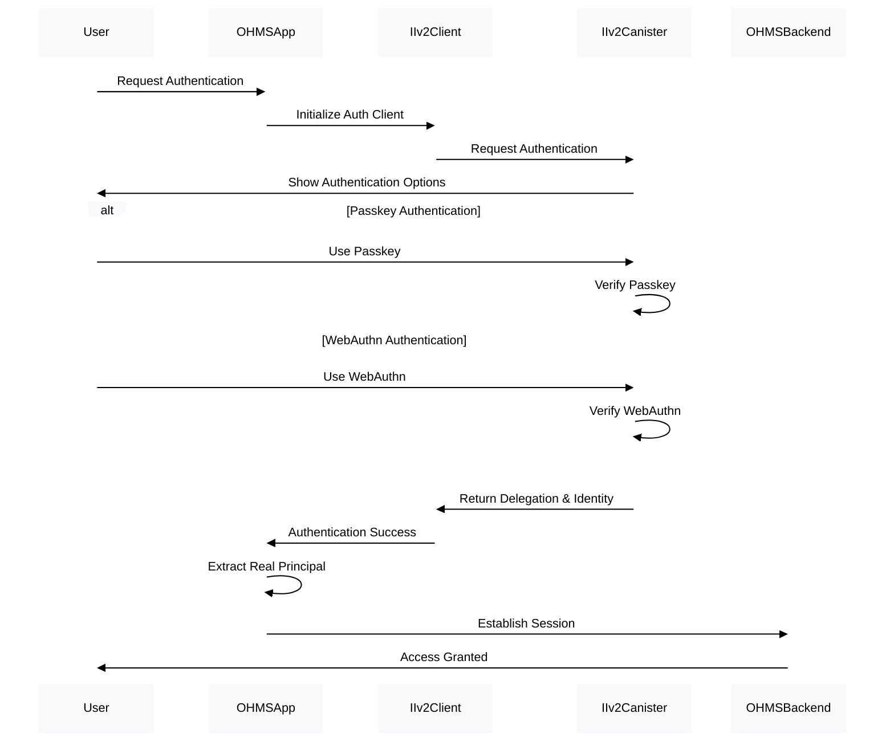

# OHMS 2.0 Real Principal Authentication Architecture
## Technical Architecture Document

**Document Type:** Technical Architecture  
**Title:** Real II v2 Principal Authentication System  
**Version:** 1.0
**Author:** OHMS Security Team
**Date:** 2025-08-21
**Status:** ✅ Production Implementation

---

## 🌐 Production Infrastructure Status

### Internet Computer Mainnet Deployment

| Component | Canister ID | Direct URL | Candid UI | Status |
|-----------|-------------|------------|-----------|--------|
| **OHMS Platform UI** | `xg5yr-zaaaa-aaaah-qqe5a-cai` | [🔗](https://xg5yr-zaaaa-aaaah-qqe5a-cai.icp0.io/) | [🎛️](https://a4gq6-oaaaa-aaaab-qaa4q-cai.raw.icp0.io/?id=xg5yr-zaaaa-aaaah-qqe5a-cai) | ✅ Production |
| **Internet Identity v2** | `rdmx6-jaaaa-aaaaa-aaadq-cai` | [🔗](https://id.ai/) | [🎛️](https://a4gq6-oaaaa-aaaab-qaa4q-cai.raw.icp0.io/?id=rdmx6-jaaaa-aaaaa-aaadq-cai) | ✅ Production |

---

## 🎯 Overview

The OHMS 2.0 Real Principal Authentication Architecture replaces all Google OAuth dependencies with authentic Internet Identity v2 principal extraction, providing secure, decentralized authentication without external service dependencies.

## 🏗️ Authentication Architecture

### Core Authentication Flow



## 🔐 Principal Extraction System

### Real Principal Service Implementation

```typescript
import { AuthClient } from '@dfinity/auth-client';
import { Identity } from '@dfinity/agent';
import { Principal } from '@dfinity/principal';

export class RealPrincipalService {
  private authClient: AuthClient | null = null;
  private currentIdentity: Identity | null = null;
  private currentPrincipal: Principal | null = null;

  // Initialize authentication client
  async initialize(): Promise<void> {
    this.authClient = await AuthClient.create({
      idleOptions: {
        idleTimeout: 1000 * 60 * 30, // 30 minutes
        disableDefaultIdleCallback: true,
      },
    });

    // Check if already authenticated
    if (await this.authClient.isAuthenticated()) {
      this.currentIdentity = this.authClient.getIdentity();
      this.currentPrincipal = this.currentIdentity.getPrincipal();
    }
  }

  // Authenticate with II v2 and extract real principal
  async authenticate(): Promise<AuthenticationResult> {
    if (!this.authClient) {
      throw new Error('Auth client not initialized');
    }

    try {
      await this.authClient.login({
        identityProvider: 'https://id.ai',
        maxTimeToLive: BigInt(24 * 60 * 60 * 1000 * 1000 * 1000), // 24 hours in nanoseconds
        onSuccess: () => {
          this.currentIdentity = this.authClient!.getIdentity();
          this.currentPrincipal = this.currentIdentity.getPrincipal();
        },
      });

      if (!this.currentPrincipal || this.currentPrincipal.isAnonymous()) {
        throw new Error('Failed to obtain valid principal');
      }

      return {
        success: true,
        principal: this.currentPrincipal,
        principalText: this.currentPrincipal.toString(),
        identity: this.currentIdentity,
        isAuthenticated: true,
      };
    } catch (error) {
      console.error('Authentication failed:', error);
      return {
        success: false,
        error: error.message,
        isAuthenticated: false,
      };
    }
  }

  // Get current authenticated principal
  getCurrentPrincipal(): Principal | null {
    return this.currentPrincipal;
  }

  // Get current identity for canister calls
  getCurrentIdentity(): Identity | null {
    return this.currentIdentity;
  }

  // Validate principal authenticity
  validatePrincipal(principal: Principal): boolean {
    return (
      principal !== null &&
      !principal.isAnonymous() &&
      principal.toString().length > 0 &&
      // Validate principal format (basic validation)
      /^[a-z0-9]{5}-[a-z0-9]{5}-[a-z0-9]{5}-[a-z0-9]{5}-[a-z0-9]{3}$/.test(principal.toString())
    );
  }

  // Check authentication status
  async isAuthenticated(): Promise<boolean> {
    if (!this.authClient) return false;
    
    const isAuth = await this.authClient.isAuthenticated();
    return isAuth && this.currentPrincipal && !this.currentPrincipal.isAnonymous();
  }

  // Logout and clear session
  async logout(): Promise<void> {
    if (this.authClient) {
      await this.authClient.logout();
      this.currentIdentity = null;
      this.currentPrincipal = null;
    }
  }
}

// Authentication result interface
export interface AuthenticationResult {
  success: boolean;
  principal?: Principal;
  principalText?: string;
  identity?: Identity;
  isAuthenticated: boolean;
  error?: string;
}
```

### Principal Validation and Security

```typescript
// Principal validation utilities
export class PrincipalValidator {
  // Comprehensive principal validation
  static validatePrincipal(principal: Principal): ValidationResult {
    const errors: string[] = [];
    const warnings: string[] = [];

    // Basic null/undefined check
    if (!principal) {
      errors.push('Principal is null or undefined');
      return { isValid: false, errors, warnings };
    }

    // Anonymous principal check
    if (principal.isAnonymous()) {
      errors.push('Principal is anonymous - authentication required');
      return { isValid: false, errors, warnings };
    }

    // Principal format validation
    const principalText = principal.toString();
    if (!principalText || principalText.length === 0) {
      errors.push('Principal text is empty');
      return { isValid: false, errors, warnings };
    }

    // Principal format regex validation
    const principalRegex = /^[a-z0-9]{5}-[a-z0-9]{5}-[a-z0-9]{5}-[a-z0-9]{5}-[a-z0-9]{3}$/;
    if (!principalRegex.test(principalText)) {
      errors.push('Principal format is invalid');
      return { isValid: false, errors, warnings };
    }

    // Length validation
    if (principalText.length !== 27) {
      warnings.push('Principal length is unexpected');
    }

    return {
      isValid: errors.length === 0,
      errors,
      warnings,
      principalText,
    };
  }

  // Check if principal has admin privileges
  static async isAdminPrincipal(principal: Principal): Promise<boolean> {
    const adminPrincipals = process.env.VITE_ADMIN_PRINCIPALS?.split(',') || [];
    return adminPrincipals.includes(principal.toString());
  }

  // Generate deterministic user identifier
  static generateUserIdentifier(principal: Principal): string {
    // Use first 8 characters of principal for user display
    const principalText = principal.toString();
    return principalText.substring(0, 8);
  }
}

export interface ValidationResult {
  isValid: boolean;
  errors: string[];
  warnings: string[];
  principalText?: string;
}
```

## 🔄 Session Management System

### Authentication Context

```typescript
import React, { createContext, useContext, useEffect, useState } from 'react';

interface AuthContextType {
  principal: Principal | null;
  identity: Identity | null;
  isAuthenticated: boolean;
  isLoading: boolean;
  login: () => Promise<void>;
  logout: () => Promise<void>;
  validateSession: () => Promise<boolean>;
}

const AuthContext = createContext<AuthContextType | undefined>(undefined);

export const AuthProvider: React.FC<{ children: React.ReactNode }> = ({ children }) => {
  const [principal, setPrincipal] = useState<Principal | null>(null);
  const [identity, setIdentity] = useState<Identity | null>(null);
  const [isAuthenticated, setIsAuthenticated] = useState(false);
  const [isLoading, setIsLoading] = useState(true);
  
  const principalService = new RealPrincipalService();

  useEffect(() => {
    const initializeAuth = async () => {
      try {
        await principalService.initialize();
        
        if (await principalService.isAuthenticated()) {
          const currentPrincipal = principalService.getCurrentPrincipal();
          const currentIdentity = principalService.getCurrentIdentity();
          
          if (currentPrincipal && PrincipalValidator.validatePrincipal(currentPrincipal).isValid) {
            setPrincipal(currentPrincipal);
            setIdentity(currentIdentity);
            setIsAuthenticated(true);
          }
        }
      } catch (error) {
        console.error('Auth initialization failed:', error);
      } finally {
        setIsLoading(false);
      }
    };

    initializeAuth();
  }, []);

  const login = async () => {
    setIsLoading(true);
    try {
      const result = await principalService.authenticate();
      
      if (result.success && result.principal) {
        setPrincipal(result.principal);
        setIdentity(result.identity!);
        setIsAuthenticated(true);
      } else {
        throw new Error(result.error || 'Authentication failed');
      }
    } catch (error) {
      console.error('Login failed:', error);
      setIsAuthenticated(false);
    } finally {
      setIsLoading(false);
    }
  };

  const logout = async () => {
    try {
      await principalService.logout();
      setPrincipal(null);
      setIdentity(null);
      setIsAuthenticated(false);
    } catch (error) {
      console.error('Logout failed:', error);
    }
  };

  const validateSession = async (): Promise<boolean> => {
    try {
      const isValid = await principalService.isAuthenticated();
      if (!isValid) {
        setIsAuthenticated(false);
        setPrincipal(null);
        setIdentity(null);
      }
      return isValid;
    } catch (error) {
      console.error('Session validation failed:', error);
      return false;
    }
  };

  return (
    <AuthContext.Provider
      value={{
        principal,
        identity,
        isAuthenticated,
        isLoading,
        login,
        logout,
        validateSession,
      }}
    >
      {children}
    </AuthContext.Provider>
  );
};

export const useAuth = () => {
  const context = useContext(AuthContext);
  if (context === undefined) {
    throw new Error('useAuth must be used within an AuthProvider');
  }
  return context;
};
```

## 🛡️ Security Implementation

### Route Protection

```typescript
// Protected Route Component
export const ProtectedRoute: React.FC<{ children: React.ReactNode }> = ({ children }) => {
  const { isAuthenticated, isLoading, principal } = useAuth();

  if (isLoading) {
    return <LoadingSpinner message="Verifying authentication..." />;
  }

  if (!isAuthenticated || !principal) {
    return <Navigate to="/login" replace />;
  }

  // Additional principal validation
  const validation = PrincipalValidator.validatePrincipal(principal);
  if (!validation.isValid) {
    console.error('Invalid principal detected:', validation.errors);
    return <Navigate to="/login" replace />;
  }

  return <>{children}</>;
};

// Admin Route Component
export const AdminRoute: React.FC<{ children: React.ReactNode }> = ({ children }) => {
  const { principal, isAuthenticated, isLoading } = useAuth();
  const [isAdmin, setIsAdmin] = useState(false);
  const [adminCheckLoading, setAdminCheckLoading] = useState(true);

  useEffect(() => {
    const checkAdminStatus = async () => {
      if (principal && isAuthenticated) {
        const adminStatus = await PrincipalValidator.isAdminPrincipal(principal);
        setIsAdmin(adminStatus);
      }
      setAdminCheckLoading(false);
    };

    checkAdminStatus();
  }, [principal, isAuthenticated]);

  if (isLoading || adminCheckLoading) {
    return <LoadingSpinner message="Verifying admin access..." />;
  }

  if (!isAuthenticated || !principal) {
    return <Navigate to="/login" replace />;
  }

  if (!isAdmin) {
    return <Navigate to="/" replace />;
  }

  return <>{children}</>;
};
```

### Authentication Guard Service

```typescript
// Authentication Guard for Canister Calls
export class AuthGuard {
  private principalService: RealPrincipalService;

  constructor(principalService: RealPrincipalService) {
    this.principalService = principalService;
  }

  // Ensure user is authenticated before canister calls
  async ensureAuthenticated(): Promise<Identity> {
    const identity = this.principalService.getCurrentIdentity();
    const principal = this.principalService.getCurrentPrincipal();

    if (!identity || !principal || principal.isAnonymous()) {
      throw new Error('Authentication required for this operation');
    }

    // Validate principal
    const validation = PrincipalValidator.validatePrincipal(principal);
    if (!validation.isValid) {
      throw new Error(`Invalid principal: ${validation.errors.join(', ')}`);
    }

    // Check session validity
    const isValid = await this.principalService.isAuthenticated();
    if (!isValid) {
      throw new Error('Session has expired - please re-authenticate');
    }

    return identity;
  }

  // Ensure user has admin privileges
  async ensureAdminAccess(): Promise<Identity> {
    const identity = await this.ensureAuthenticated();
    const principal = this.principalService.getCurrentPrincipal()!;

    const isAdmin = await PrincipalValidator.isAdminPrincipal(principal);
    if (!isAdmin) {
      throw new Error('Admin access required for this operation');
    }

    return identity;
  }

  // Get current principal with validation
  getValidatedPrincipal(): Principal {
    const principal = this.principalService.getCurrentPrincipal();
    
    if (!principal) {
      throw new Error('No authenticated principal found');
    }

    const validation = PrincipalValidator.validatePrincipal(principal);
    if (!validation.isValid) {
      throw new Error(`Invalid principal: ${validation.errors.join(', ')}`);
    }

    return principal;
  }
}
```

## 🔧 Canister Integration

### Agent Configuration with Real Identity

```typescript
import { createAgent, ActorConfig } from '@dfinity/agent';

export class CanisterService {
  private agent: Agent | null = null;
  private authGuard: AuthGuard;

  constructor(authGuard: AuthGuard) {
    this.authGuard = authGuard;
  }

  // Initialize agent with authenticated identity
  async initializeAgent(): Promise<void> {
    const identity = await this.authGuard.ensureAuthenticated();
    
    this.agent = await createAgent({
      identity,
      host: process.env.VITE_HOST || 'https://ic0.app',
    });

    // Fetch root key in development
    if (process.env.NODE_ENV === 'development') {
      await this.agent.fetchRootKey();
    }
  }

  // Create canister actor with authentication
  async createActor<T>(canisterId: string, idlFactory: any): Promise<T> {
    if (!this.agent) {
      await this.initializeAgent();
    }

    return Actor.createActor(idlFactory, {
      agent: this.agent!,
      canisterId,
    });
  }

  // Get current authenticated principal for canister calls
  getCurrentPrincipal(): Principal {
    return this.authGuard.getValidatedPrincipal();
  }
}
```


## ⚡ Performance & Error Handling

### Error Handling Strategy

```typescript
// Authentication error types
export enum AuthErrorType {
  AUTHENTICATION_FAILED = 'AUTHENTICATION_FAILED',
  INVALID_PRINCIPAL = 'INVALID_PRINCIPAL',
  SESSION_EXPIRED = 'SESSION_EXPIRED',
  PERMISSION_DENIED = 'PERMISSION_DENIED',
  SERVICE_UNAVAILABLE = 'SERVICE_UNAVAILABLE',
}

export class AuthError extends Error {
  constructor(
    public type: AuthErrorType,
    message: string,
    public retryable: boolean = false
  ) {
    super(message);
    this.name = 'AuthError';
  }
}

// Error handling utilities
export class AuthErrorHandler {
  static handleAuthError(error: any): AuthError {
    if (error instanceof AuthError) {
      return error;
    }

    // Map common errors to auth errors
    if (error.message?.includes('anonymous')) {
      return new AuthError(
        AuthErrorType.AUTHENTICATION_FAILED,
        'Authentication required - please sign in',
        true
      );
    }

    if (error.message?.includes('expired')) {
      return new AuthError(
        AuthErrorType.SESSION_EXPIRED,
        'Session has expired - please sign in again',
        true
      );
    }

    if (error.message?.includes('permission')) {
      return new AuthError(
        AuthErrorType.PERMISSION_DENIED,
        'Insufficient permissions for this operation',
        false
      );
    }

    // Default to generic auth error
    return new AuthError(
      AuthErrorType.SERVICE_UNAVAILABLE,
      'Authentication service temporarily unavailable',
      true
    );
  }

  static shouldRetry(error: AuthError): boolean {
    return error.retryable;
  }
}
```

## 📊 Monitoring & Analytics

### Authentication Metrics

```typescript
// Authentication metrics service
export class AuthMetrics {
  private static metrics = {
    loginAttempts: 0,
    loginSuccesses: 0,
    loginFailures: 0,
    sessionTimeouts: 0,
    principalValidationErrors: 0,
  };

  static recordLoginAttempt(): void {
    this.metrics.loginAttempts++;
  }

  static recordLoginSuccess(): void {
    this.metrics.loginSuccesses++;
  }

  static recordLoginFailure(): void {
    this.metrics.loginFailures++;
  }

  static recordSessionTimeout(): void {
    this.metrics.sessionTimeouts++;
  }

  static recordPrincipalValidationError(): void {
    this.metrics.principalValidationErrors++;
  }

  static getMetrics() {
    return {
      ...this.metrics,
      successRate: this.metrics.loginAttempts > 0 
        ? this.metrics.loginSuccesses / this.metrics.loginAttempts 
        : 0,
    };
  }

  static resetMetrics(): void {
    Object.keys(this.metrics).forEach(key => {
      this.metrics[key as keyof typeof this.metrics] = 0;
    });
  }
}
```

## ✅ Testing Strategy

### Authentication Testing

```typescript
// Mock principal service for testing
export class MockPrincipalService extends RealPrincipalService {
  private mockPrincipal: Principal | null = null;
  private mockIdentity: Identity | null = null;
  private authenticated = false;

  setMockAuthentication(principal: Principal, identity: Identity): void {
    this.mockPrincipal = principal;
    this.mockIdentity = identity;
    this.authenticated = true;
  }

  clearMockAuthentication(): void {
    this.mockPrincipal = null;
    this.mockIdentity = null;
    this.authenticated = false;
  }

  async authenticate(): Promise<AuthenticationResult> {
    if (this.mockPrincipal) {
      return {
        success: true,
        principal: this.mockPrincipal,
        principalText: this.mockPrincipal.toString(),
        identity: this.mockIdentity,
        isAuthenticated: true,
      };
    }

    return {
      success: false,
      error: 'Mock authentication not configured',
      isAuthenticated: false,
    };
  }

  getCurrentPrincipal(): Principal | null {
    return this.mockPrincipal;
  }

  getCurrentIdentity(): Identity | null {
    return this.mockIdentity;
  }

  async isAuthenticated(): Promise<boolean> {
    return this.authenticated;
  }
}

// Test utilities
export class AuthTestUtils {
  static createMockPrincipal(principalText?: string): Principal {
    return Principal.fromText(principalText || 'rdmx6-jaaaa-aaaaa-aaadq-cai');
  }

  static createMockIdentity(): Identity {
    // Create mock identity for testing
    return {
      getPrincipal: () => this.createMockPrincipal(),
      transformRequest: (request: any) => Promise.resolve(request),
    } as Identity;
  }
}
```

## 🚀 Deployment Configuration

### Environment Configuration

```bash
# Environment variables for production
VITE_II_CANISTER_ID="rdmx6-jaaaa-aaaaa-aaadq-cai"
VITE_II_HOST="https://id.ai"
VITE_HOST="https://ic0.app"
VITE_ADMIN_PRINCIPALS="admin1-principal,admin2-principal"

# Development environment
NODE_ENV="development"
VITE_DEBUG_AUTH="true"
VITE_MOCK_AUTH="false"
```

---

## 🎯 Success Criteria

### Technical Success
- ✅ Real II v2 principal extraction without Google OAuth dependencies
- ✅ Secure session management with principal-based authentication
- ✅ Admin role verification using principal validation
- ✅ Protected routes with proper authentication guards
- ✅ Canister integration with authenticated identity
- ✅ Comprehensive error handling and recovery

### Security Success
- ✅ No external authentication service dependencies
- ✅ Principal validation prevents anonymous access
- ✅ Session security with proper timeout handling
- ✅ Admin access control with principal verification
- ✅ Secure canister communication with authenticated identity

### User Experience Success
- ✅ Seamless II v2 authentication flow
- ✅ Clear error messages for authentication failures
- ✅ Automatic session recovery where possible
- ✅ Fast authentication response times
- ✅ Intuitive authentication interface

---

**This architecture specification provides the complete foundation for implementing secure, real principal-based authentication in OHMS 2.0, eliminating all Google OAuth dependencies while maintaining enterprise-grade security and user experience.**