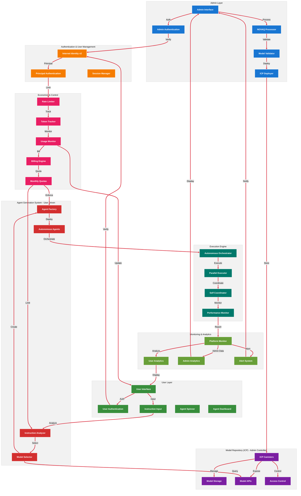
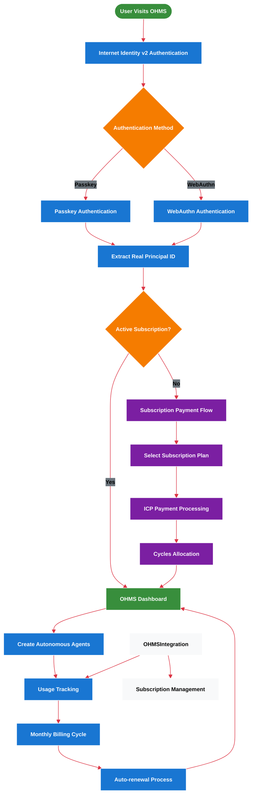
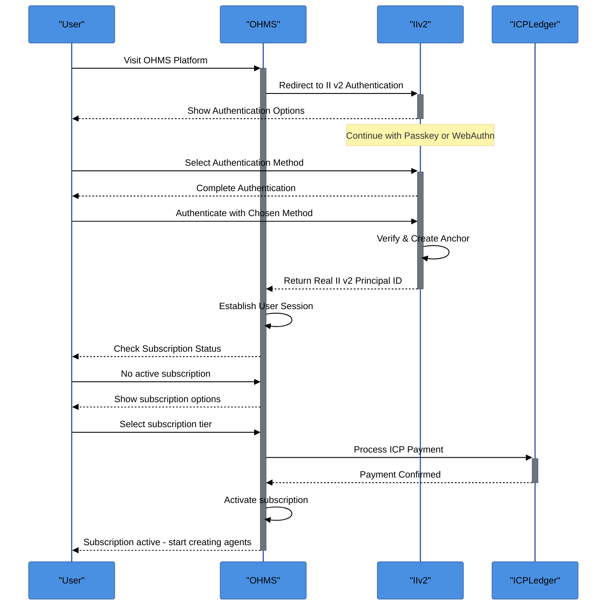
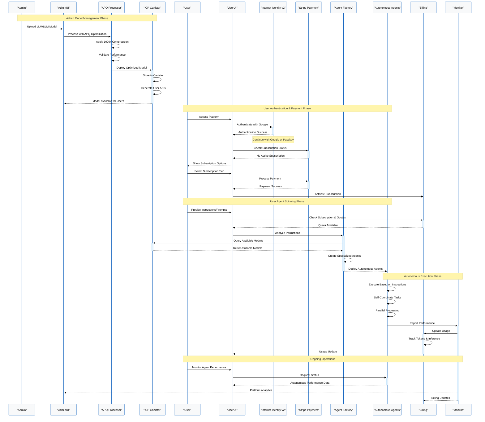
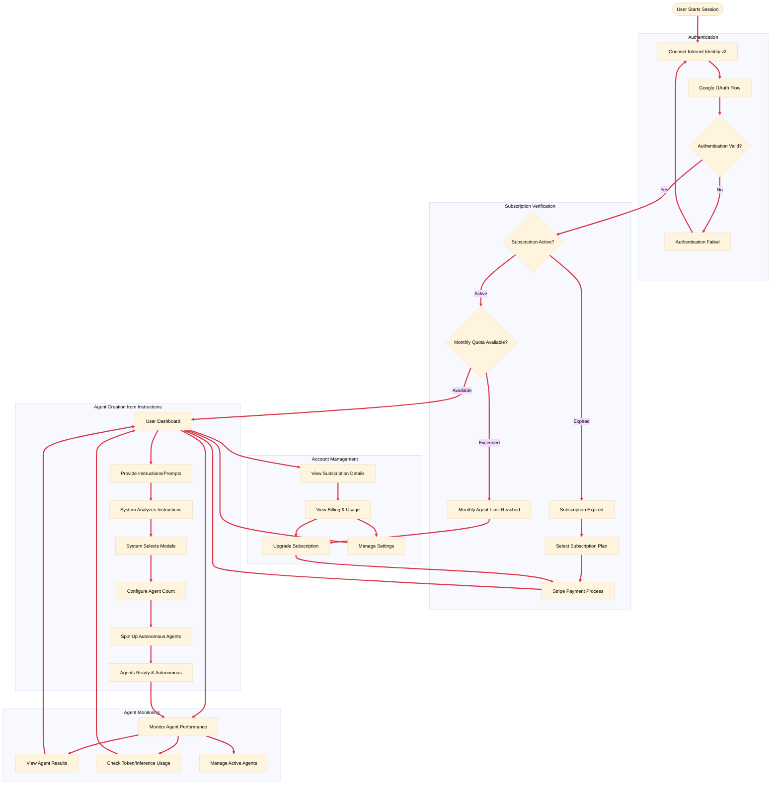
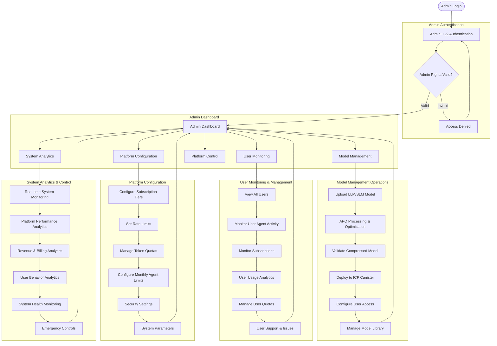
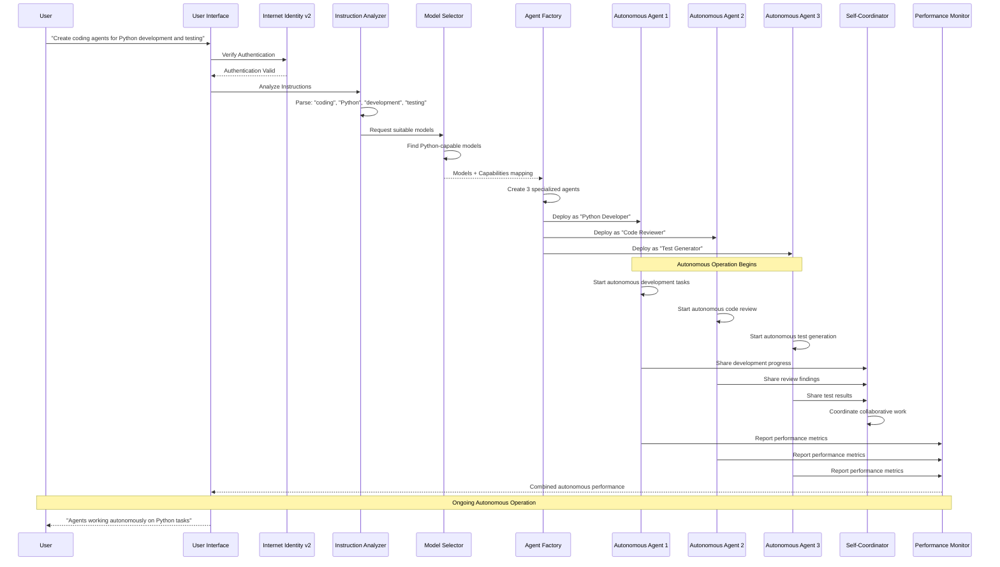
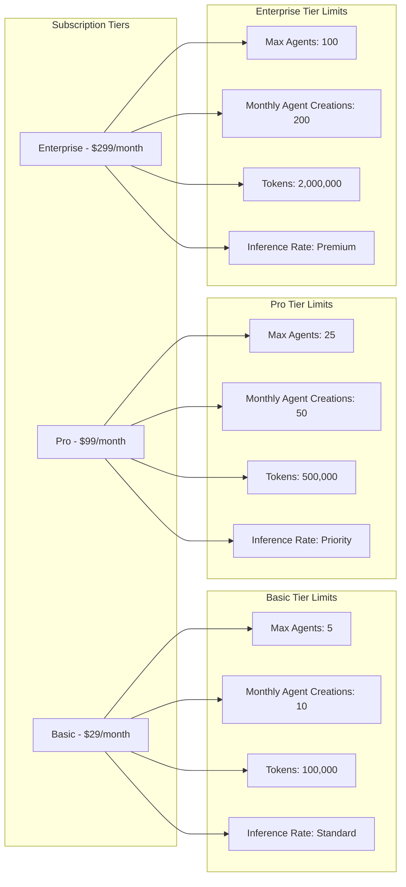
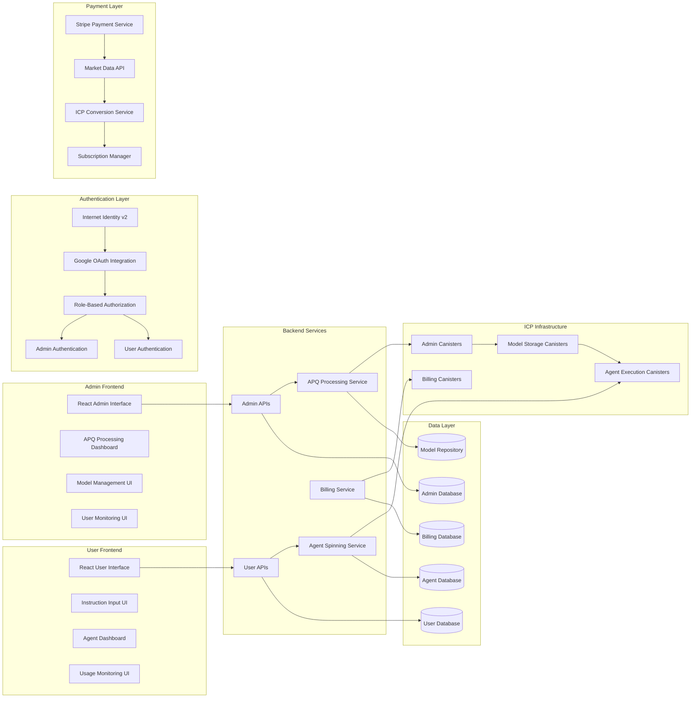

# OHMS 2.0 System Architecture & Workflows - Real II v2 Principal Authentication

## 🌐 Production Infrastructure Status

### Internet Computer Mainnet Deployment

| Component | Canister ID | Direct URL | Candid UI | Status |
|-----------|-------------|------------|-----------|--------|
| **OHMS Agent Factory** | `gavyi-uyaaa-aaaaa-qbu7q-cai` | [🔗](https://gavyi-uyaaa-aaaaa-qbu7q-cai.icp0.io/) | [🎛️](https://a4gq6-oaaaa-aaaab-qaa4q-cai.raw.icp0.io/?id=gavyi-uyaaa-aaaaa-qbu7q-cai) | ✅ Production |
| **OHMS Coordinator** | `xp6tn-piaaa-aaaah-qqe4q-cai` | [🔗](https://xp6tn-piaaa-aaaah-qqe4q-cai.icp0.io/) | [🎛️](https://a4gq6-oaaaa-aaaab-qaa4q-cai.raw.icp0.io/?id=xp6tn-piaaa-aaaah-qqe4q-cai) | ✅ Production |
| **OHMS Economics** | `tetse-piaaa-aaaao-qkeyq-cai` | [🔗](https://tetse-piaaa-aaaao-qkeyq-cai.icp0.io/) | [🎛️](https://a4gq6-oaaaa-aaaab-qaa4q-cai.raw.icp0.io/?id=tetse-piaaa-aaaao-qkeyq-cai) | ✅ Production |
| **OHMS Model Repository** | `3aes4-xyaaa-aaaal-qsryq-cai` | [🔗](https://3aes4-xyaaa-aaaal-qsryq-cai.icp0.io/) | [🎛️](https://a4gq6-oaaaa-aaaab-qaa4q-cai.raw.icp0.io/?id=3aes4-xyaaa-aaaal-qsryq-cai) | ✅ Production |
| **OHMS Platform UI** | `xg5yr-zaaaa-aaaah-qqe5a-cai` | [🔗](https://xg5yr-zaaaa-aaaah-qqe5a-cai.icp0.io/) | [🎛️](https://a4gq6-oaaaa-aaaab-qaa4q-cai.raw.icp0.io/?id=xg5yr-zaaaa-aaaah-qqe5a-cai) | ✅ Production |
| **OHMS Marketing Website** | `rjeaj-jyaaa-aaaau-abyka-cai` | [🔗](https://rjeaj-jyaaa-aaaau-abyka-cai.icp0.io/) | [🎛️](https://a4gq6-oaaaa-aaaab-qaa4q-cai.raw.icp0.io/?id=rjeaj-jyaaa-aaaau-abyka-cai) | ✅ Production |

### NOVAQ Compression Engine
- **Status**: ✅ Complete - Open Source CLI Tool
- **Repository**: [ohms-adaptq](https://github.com/OHMS-DeAI/ohms-adaptq)
- **Installation**: `cargo install --git https://github.com/OHMS-DeAI/ohms-adaptq.git`

---

## System Architecture Diagram

## Real II v2 Principal Authentication Flow

## Real Principal Authentication Flow

## System Workflow Diagram

## User Workflow Diagram

## Admin Workflow Diagram

## Agent Spinning & Autonomous Operation Flow

## Subscription Tiers & Quotas Diagram

## Technology Stack Overview (Admin-User Separated)

This comprehensive architecture separates admin model management from user agent spinning, with clear subscription-based quotas and autonomous agent operations, powered by Internet Identity v2 + Stripe integration.