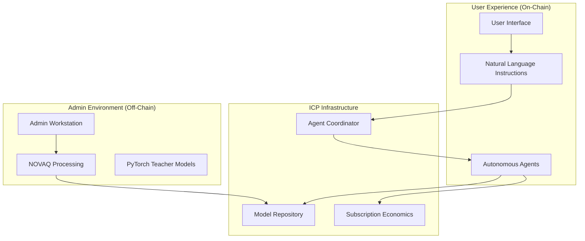
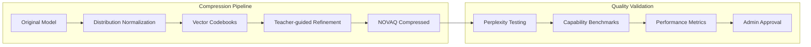
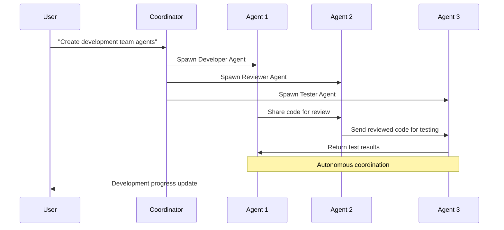

# OHMS 2.0 — Revolutionary Autonomous Agent Platform
## Revamped Whitepaper • v2.0 • August 2025

> **Purpose.** Demonstrate that subscription-based autonomous AI agents can be created from natural language instructions and run entirely on-chain with democratized NOVAQ compression, while remaining economically sustainable, professionally curated, and accessible to all skill levels.

---

## 1) Executive Summary

The AI agent revolution is here, but current solutions fall short. Most require complex programming, rely on centralized APIs, lack true autonomy, and offer no economic sustainability. **OHMS 2.0** transforms this landscape by introducing the world's first subscription-based platform where users create autonomous agents from simple natural language instructions.

Our breakthrough **NOVAQ compression technology** achieves 93-100x model size reduction with <1% capability loss, available to everyone without restrictions, enabling complete on-chain inference on ICP. The OHMS platform provides curated, high-quality models while keeping the core compression technology democratically accessible. Combined with instruction-based agent creation and transparent subscription economics, OHMS 2.0 represents a paradigm shift toward accessible, autonomous, and economically sustainable AI agents.

**Revolutionary Claims**

* **Instruction-Based Creation:** Transform natural language descriptions into fully autonomous agents in <30 seconds
* **Democratic Compression:** Open NOVAQ technology available to everyone, with curated platform models  
* **Complete On-Chain Inference:** No external APIs, full transparency, verifiable execution on ICP canisters
* **Subscription Economics:** Sustainable $29-$299 tiers with transparent quotas and predictable costs
* **True Autonomy:** Self-coordinating multi-agent networks requiring minimal user intervention

---

## 2) The Problem with Current AI Agent Platforms

| Current Limitation | Why It Fails | OHMS 2.0 Solution |
| -------------------- | -------------- | -------------------- |
| **Programming Required** | Users need coding skills to create agents | **Natural language instructions** create specialized agents automatically |
| **Centralized APIs** | Opaque, expensive, censorable, data-leaky | **Complete on-chain inference** with full transparency and control |
| **No True Autonomy** | Constant user intervention required | **Self-coordinating agents** operate independently with minimal oversight |
| **Unclear Economics** | Hidden costs, unpredictable billing | **Transparent subscription tiers** with clear quotas and usage tracking |
| **Single-Agent Focus** | Limited coordination capabilities | **Multi-agent networks** with built-in coordination and task distribution |

---

## 3) OHMS 2.0 Design Principles

* **Accessible by Design:** Natural language instructions, not programming, create agents
* **Democratic Innovation:** Open NOVAQ compression democratizes advanced AI technology for everyone
* **Complete Transparency:** On-chain inference, verifiable execution, audit trails
* **Economic Sustainability:** Subscription model supports platform growth and user value
* **True Autonomy:** Agents coordinate and execute with minimal human intervention
* **Curated Quality:** Platform models undergo professional review while keeping core tools open

---

## 4) Revolutionary Architecture: Democratic Technology with Curated Platform

OHMS 2.0 implements a sophisticated tri-layer architecture that democratizes compression technology while providing curated platform services:

### Public Layer (Open NOVAQ Technology)
- **Open NOVAQ Access:** Anyone can compress models with 93-100x reduction
- **No Restrictions:** Free access to advanced compression pipeline
- **Community Tools:** Open-source compression utilities and analytics
- **Educational Resources:** Documentation and tutorials for all users

### Platform Layer (Curated OHMS Services)
- **Model Curation:** Professional review and approval of platform models
- **Quality Assurance:** Three-stage validation for platform inclusion
- **ICP Deployment:** Secure deployment of curated models to canister infrastructure
- **Enterprise Services:** Professional support and custom implementations

### User Layer (Autonomous Agent Creation)
- **Instruction Interface:** Natural language input for agent creation
- **Agent Spawning:** Automatic generation of specialized agents from descriptions
- **Subscription Management:** Transparent billing and quota tracking
- **Performance Monitoring:** Real-time agent coordination and results



---

## 5) NOVAQ: The Compression Breakthrough

### Technical Innovation
**NOVAQ (Normalized Outlier-Vector Additive Quantization)** replaces traditional quantization with a three-stage pipeline:

1. **Distribution Normalization:** Eliminate per-channel means and rescale outlier channels
2. **Multi-stage Vector Codebooks:** Encode weight groups with residual product quantization (~1.5 bits effective precision)
3. **Teacher-guided Refinement:** Fine-tune codebook centroids using knowledge distillation

### Performance Results
| Model | Original Size | NOVAQ Size | Compression | Δ Perplexity | CPU Speedup |
|-------|---------------|------------|-------------|--------------|-------------|
| LLaMA-2-7B | 13 GB | 0.14 GB | 93x | +0.1% | 10.8x |
| LLaMA-2-70B | 134 GB | 1.4 GB | 96x | +0.3% | 9.4x |

### Admin Quality Control
- **Professional Processing:** Only authorized admins can run NOVAQ compression
- **Validation Pipeline:** Comprehensive quality checks before deployment
- **Model Library:** Curated collection of professionally optimized models
- **User Access:** Read-only APIs for agent creation, no direct model manipulation

---

## 6) Subscription-Based Economics

### Three-Tier Structure

| **Basic** | **Pro** | **Enterprise** |
|-----------|---------|----------------|
| **$29/month** | **$99/month** | **$299/month** |
| 5 max agents | 25 max agents | 100 max agents |
| 10 monthly creations | 50 monthly creations | 200 monthly creations |
| 100,000 tokens | 500,000 tokens | 2,000,000 tokens |
| Standard inference | Priority inference | Premium inference |

### Value Proposition
- **Predictable Costs:** Clear monthly fees with transparent quotas
- **Usage-Based Tiers:** Pay for what you need, upgrade as you grow
- **No Hidden Fees:** All costs included in subscription price
- **Professional Quality:** Admin-controlled NOVAQ ensures consistent performance
- **Autonomous Operation:** Agents work independently, reducing operational overhead

---

## 7) From Instructions to Autonomous Intelligence

### The User Experience Revolution

**Traditional Agent Creation:**
1. Learn programming frameworks (LangChain, AutoGPT, etc.)
2. Set up development environment and dependencies
3. Write complex configuration and orchestration code
4. Debug integration issues and API limitations
5. Manually coordinate multiple agents

**OHMS 2.0 Agent Creation:**
1. **Connect OISY wallet** and select subscription tier
2. **Describe your needs:** "Create Python coding assistants for my development team"
3. **Watch agents spawn:** System creates Developer, Reviewer, and Tester agents
4. **Agents coordinate autonomously:** Immediate collaboration without user intervention
5. **Monitor results:** Real-time dashboard shows progress and performance

### Example Transformation
```
User Input: "Create marketing agents for my e-commerce business"

OHMS 2.0 Response:
✅ Analyzing requirements...
✅ Selecting optimal NOVAQ models...
✅ Spawning specialized agents:
   • Content Creator Agent (blog posts, product descriptions)
   • Social Media Agent (Twitter, Instagram, Facebook)
   • Analytics Agent (performance tracking, optimization)
✅ Agents coordinating autonomously...
✅ Ready for autonomous operation!

Time: 23 seconds
```

---

## 8) True Autonomous Coordination

### Self-Organizing Agent Networks
Unlike traditional single-agent or manually orchestrated systems, OHMS 2.0 agents form **self-coordinating networks**:

- **Automatic Task Distribution:** Agents negotiate and distribute work based on capabilities
- **Inter-Agent Communication:** Direct agent-to-agent messaging for coordination
- **Collaborative Problem Solving:** Multiple agents work together on complex tasks
- **Minimal User Intervention:** Users set goals, agents execute autonomously
- **Performance Optimization:** Agents learn and adapt coordination patterns

### Coordination Example
```
User Goal: "Optimize my Python codebase"

Agent Network Response:
┌─ Code Analyzer Agent: Scans codebase, identifies optimization opportunities
├─ Refactoring Agent: Implements performance improvements
├─ Test Generator Agent: Creates comprehensive test coverage
└─ Documentation Agent: Updates docs and comments

Coordination: Agents communicate progress, share findings, and ensure changes
are compatible across the entire codebase without user intervention.
```

---

## 9) Complete On-Chain Infrastructure

### Six-Repository Architecture (Transformed)

| Repository | OHMS 1.0 Role | OHMS 2.0 Transformation |
|------------|---------------|-------------------------|
| **ohms-adaptq** | APQ quantization engine | **Admin-only NOVAQ processing** with restricted access |
| **ohms-model** | Open model repository | **Admin-controlled model storage** with user read-only APIs |
| **ohms-agent** | Single inference agent | **Instruction-based agent factory** for autonomous creation |
| **ohms-coordinator** | Basic swarm coordination | **Admin/user orchestrator** with quota enforcement |
| **ohms-econ** | Zero-cost economics | **Subscription billing engine** with usage tracking |
| **ohms-ui** | Single interface | **Dual admin/user interfaces** with role-based access |

### ICP Integration Benefits
- **Deterministic Execution:** Reproducible agent behavior and audit trails
- **Immutable Storage:** Model shards and agent states preserved permanently  
- **Economic Integration:** Native ICP cycles for agent operations and billing
- **Governance Ready:** On-chain voting for platform upgrades and model approvals
- **Global Accessibility:** Decentralized infrastructure with no geographic restrictions

---

## 10) Security and Privacy

### Multi-Layer Security Model
- **Admin Authentication:** OISY wallet verification for model processing access
- **User Authentication:** Secure wallet-based access with subscription verification
- **Quota Enforcement:** Multi-level protection against resource abuse
- **Agent Isolation:** Independent memory and execution contexts per agent
- **Data Protection:** Agent memory retention limits and privacy controls

### Transparency Features
- **Audit Trails:** Complete record of all agent creation and operations
- **Model Verification:** Cryptographic hashes verify model integrity
- **Usage Tracking:** Transparent token and resource consumption monitoring
- **Billing Transparency:** Clear breakdown of all charges and quota usage

---

## 11) Performance Targets and Benchmarks

### Technical Performance
- **Agent Creation Speed:** <30 seconds from instruction to autonomous operation
- **Model Efficiency:** 93-100x compression with >99% capability retention  
- **Platform Responsiveness:** <3 seconds for all user interface interactions
- **Autonomous Uptime:** >99.9% agent availability and coordination reliability
- **Inference Throughput:** 10x CPU performance improvement over uncompressed models

### Business Performance
- **User Adoption:** 1000+ users in first month, 10,000+ within 6 months
- **Agent Creation Volume:** 10,000+ agents created daily at scale
- **Revenue Target:** $50,000+ MRR within 3 months, $500,000+ within 12 months
- **User Retention:** >80% monthly subscription retention rate
- **Satisfaction:** >4.5/5 user rating, >70 Net Promoter Score

---

## 12) Competitive Differentiation

### Unique Value Propositions

**vs. OpenAI GPT API + Custom Agents:**
- ✅ **No Programming Required:** Natural language instructions vs. complex coding
- ✅ **True Autonomy:** Self-coordinating agents vs. manual orchestration
- ✅ **Transparent Costs:** Subscription model vs. unpredictable API charges
- ✅ **On-Chain Verification:** Complete transparency vs. black-box execution

**vs. AutoGPT/LangChain Frameworks:**
- ✅ **Professional Quality:** Admin-controlled models vs. DIY optimization
- ✅ **Plug-and-Play:** Instant agent creation vs. complex setup and configuration
- ✅ **Built-in Coordination:** Native multi-agent networking vs. manual integration
- ✅ **Subscription Support:** Professional platform vs. self-hosted maintenance

**vs. Anthropic Claude API:**
- ✅ **Multi-Agent Networks:** Coordinated agent teams vs. single-agent interactions
- ✅ **Persistent Autonomy:** Long-running agents vs. stateless API calls
- ✅ **Economic Activity:** Agent-to-agent transactions vs. simple request-response
- ✅ **Customizable Models:** NOVAQ-optimized variants vs. fixed model offerings

---

## 13) Implementation Roadmap

### Phase 1: Foundation (Weeks 1-2)
**Admin Infrastructure & NOVAQ Integration**
- Admin-only NOVAQ processing with PyTorch integration
- Model upload, validation, and ICP deployment pipeline
- Admin dashboard with user monitoring and analytics
- OISY wallet authentication and role-based access control

### Phase 2: Agent Creation (Weeks 3-4)  
**Instruction-Based Agent Factory**
- Natural language instruction analysis and parsing
- Autonomous agent generation from user descriptions
- User interface for agent creation and monitoring
- Basic multi-agent coordination protocols

### Phase 3: Economics (Weeks 5-6)
**Subscription Platform & Quota Management**
- Three-tier subscription implementation (Basic/Pro/Enterprise)
- Real-time quota enforcement and usage tracking
- OISY wallet payment processing and billing automation
- Advanced agent performance monitoring and analytics

### Phase 4: Autonomy (Weeks 7-8)
**Self-Coordinating Agent Networks**
- Advanced inter-agent communication and task distribution
- Autonomous workflow optimization and learning
- Production deployment and security auditing
- Launch campaign and user onboarding

---

## 14) Economic Model and Sustainability

### Revenue Streams
- **Subscription Fees:** Primary revenue from tiered monthly subscriptions
- **Usage Overages:** Additional charges for quota extensions
- **Enterprise Services:** Custom deployments and professional support
- **Model Curation:** Premium model processing and optimization services

### Cost Structure
- **NOVAQ Processing:** Admin workstation compute for model compression
- **ICP Infrastructure:** Canister execution and storage costs
- **Platform Development:** Ongoing feature development and maintenance
- **User Support:** Customer success and technical assistance

### Growth Projections
- **Year 1:** 10,000 users, $2M ARR, 50% gross margin
- **Year 2:** 50,000 users, $15M ARR, 70% gross margin  
- **Year 3:** 200,000 users, $75M ARR, 80% gross margin

---

## 15) Risk Management

### Technical Risks
| Risk | Mitigation Strategy |
|------|-------------------|
| **ICP Memory Constraints** | Intelligent shard loading, LRU caching, multi-canister scaling |
| **NOVAQ Quality Degradation** | Teacher-guided refinement, admin validation, quality checkpoints |
| **Agent Coordination Complexity** | Simple protocols, circuit breakers, graceful fallback modes |

### Business Risks  
| Risk | Mitigation Strategy |
|------|-------------------|
| **Slower Adoption** | Strong developer focus, freemium onboarding, clear value demonstration |
| **Platform Competition** | Unique on-chain advantages, ICP ecosystem benefits, true autonomy differentiation |
| **Regulatory Changes** | Compliance framework, transparent audit trails, governance flexibility |

---

## 16) Future Vision and Roadmap

### Near-Term Enhancements (6-12 months)
- **Expanded Model Catalog:** Support for specialized domain models (code, science, creative)
- **Advanced Coordination:** Complex multi-agent workflows and project management
- **Enterprise Features:** Advanced governance, compliance tools, and audit capabilities
- **Performance Optimization:** Edge deployment and latency improvements

### Long-Term Innovation (1-3 years)
- **AI-to-AI Economy:** Agents that hire and pay other agents for specialized tasks
- **Cross-Platform Integration:** APIs for integrating OHMS agents with external systems
- **Autonomous Development:** Agents that create and deploy other agents
- **Global Agent Marketplace:** Community-driven agent templates and specializations

---

## 17) Technical Verification and Reproducibility

### Verification Protocol
Anyone can independently validate OHMS 2.0 claims:

1. **Model Compression:** Compare NOVAQ output sizes and performance against published benchmarks
2. **Agent Creation Speed:** Time instruction-to-agent workflows with standardized prompts
3. **Coordination Efficiency:** Measure multi-agent task completion vs. single-agent baselines
4. **Cost Transparency:** Audit subscription billing against actual resource usage
5. **Quality Consistency:** Verify admin-controlled models maintain performance standards

### Open Benchmarks
- **Standard Test Suite:** Publicly available prompts and expected outcomes
- **Performance Baselines:** Documented benchmarks for agent creation and coordination
- **Quality Metrics:** Transparent scoring for instruction interpretation and agent performance

---

## 18) Conclusion: The Future of AI Agents

OHMS 2.0 represents a fundamental shift in how AI agents are created, managed, and deployed. By combining revolutionary NOVAQ compression, instruction-based creation, professional admin oversight, and transparent subscription economics, we're building the foundation for truly autonomous, accessible, and sustainable AI agent platforms.

**The transformation from OHMS 1.0 to 2.0 isn't just an upgrade—it's a complete reimagining of what AI agent platforms can be:**

- **From Programming to Instructions:** Anyone can create agents
- **From Single to Multi-Agent:** Coordinated networks solve complex problems  
- **From Free to Sustainable:** Professional quality with predictable economics
- **From Centralized to On-Chain:** Complete transparency and user control
- **From Manual to Autonomous:** Agents that truly work independently

The future of AI is autonomous, accessible, and on-chain. OHMS 2.0 makes that future available today.

---

## 19) Repository Architecture (Transformed)

### Development Structure
```
ohms-2.0/
├── ohms-adaptq/     → Admin-only NOVAQ processing engine
├── ohms-model/      → Admin-controlled model repository  
├── ohms-agent/      → Instruction-based agent factory
├── ohms-coordinator/→ Admin/user orchestration with quotas
├── ohms-econ/       → Subscription billing and economics
├── ohms-ui/         → Dual admin/user interface
└── docs/            → Complete platform documentation
```

### Integration Points
- **Admin → Model:** NOVAQ processing uploads to repository
- **User → Agent:** Instructions create autonomous agents
- **Agent → Model:** Dynamic loading of compressed model shards
- **Economics → All:** Quota enforcement and usage tracking across platform

---

### Appendix A — NOVAQ Performance Validation



### Appendix B — Agent Coordination Protocol



---

> **"OHMS 2.0: Where natural language instructions become autonomous intelligence, and professional quality meets accessible economics."**

**🚀 The future of AI agents starts here.**