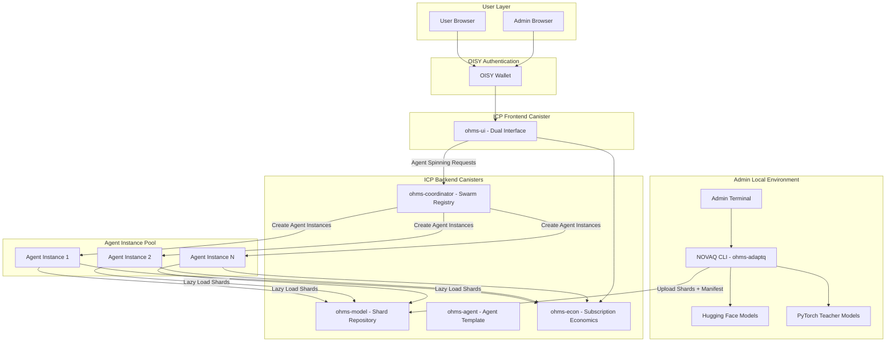
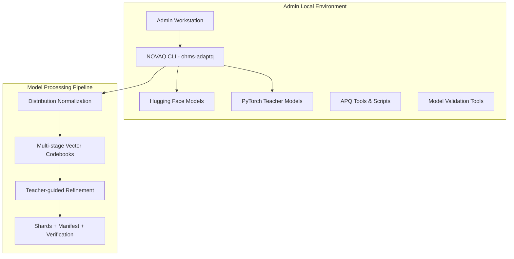
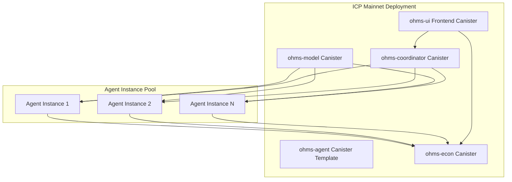
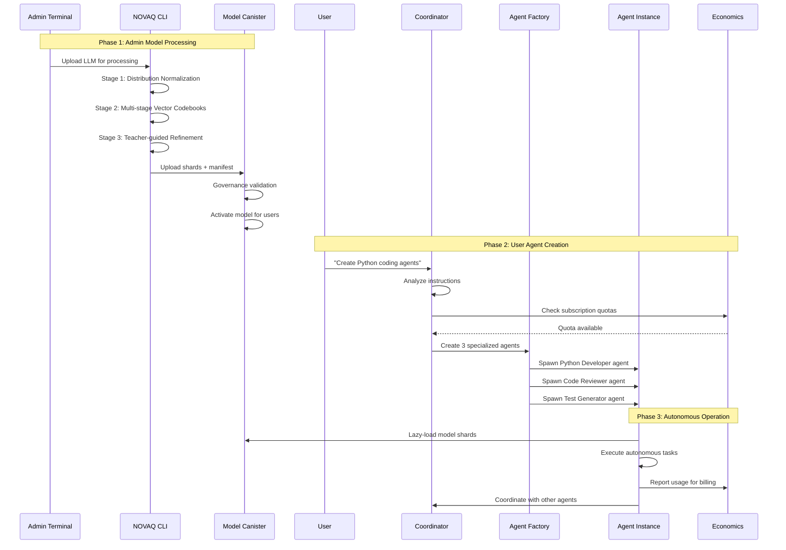
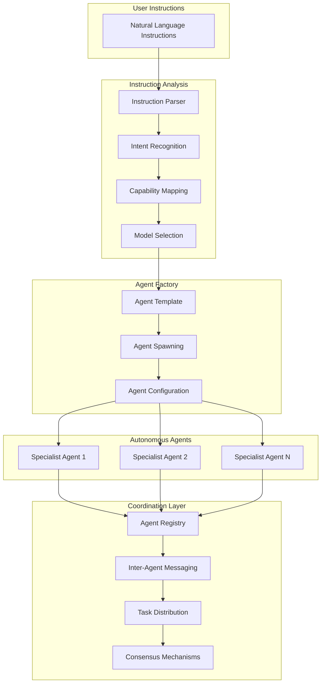
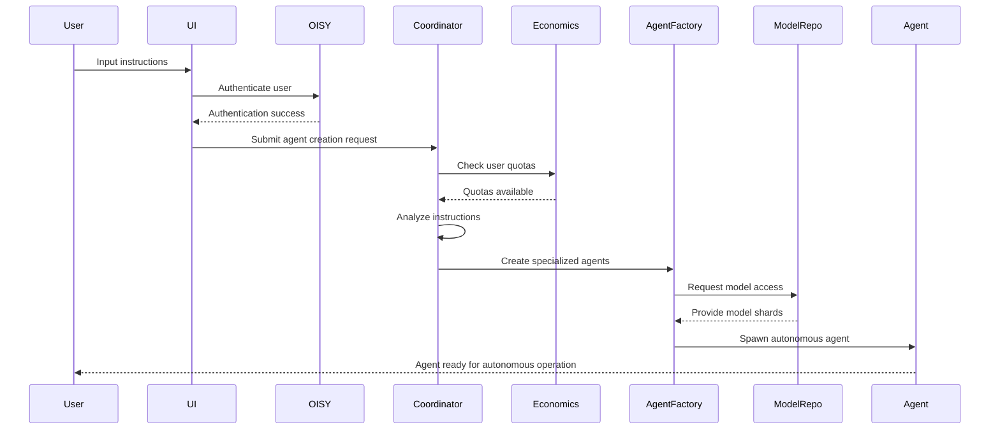

# OHMS 2.0 Sharded Full-Stack Architecture
*Revolutionary Autonomous Agent Platform with NOVAQ Compression*

## 🌐 Production Infrastructure Status

### Internet Computer Mainnet Deployment

| Component | Canister ID | Direct URL | Candid UI | Status |
|-----------|-------------|------------|-----------|--------|
| **OHMS Agent Factory** | `gavyi-uyaaa-aaaaa-qbu7q-cai` | [🔗](https://gavyi-uyaaa-aaaaa-qbu7q-cai.icp0.io/) | [🎛️](https://a4gq6-oaaaa-aaaab-qaa4q-cai.raw.icp0.io/?id=gavyi-uyaaa-aaaaa-qbu7q-cai) | ✅ Production |
| **OHMS Coordinator** | `xp6tn-piaaa-aaaah-qqe4q-cai` | [🔗](https://xp6tn-piaaa-aaaah-qqe4q-cai.icp0.io/) | [🎛️](https://a4gq6-oaaaa-aaaab-qaa4q-cai.raw.icp0.io/?id=xp6tn-piaaa-aaaah-qqe4q-cai) | ✅ Production |
| **OHMS Economics** | `tetse-piaaa-aaaao-qkeyq-cai` | [🔗](https://tetse-piaaa-aaaao-qkeyq-cai.icp0.io/) | [🎛️](https://a4gq6-oaaaa-aaaab-qaa4q-cai.raw.icp0.io/?id=tetse-piaaa-aaaao-qkeyq-cai) | ✅ Production |
| **OHMS Model Repository** | `3aes4-xyaaa-aaaal-qsryq-cai` | [🔗](https://3aes4-xyaaa-aaaal-qsryq-cai.icp0.io/) | [🎛️](https://a4gq6-oaaaa-aaaab-qaa4q-cai.raw.icp0.io/?id=3aes4-xyaaa-aaaal-qsryq-cai) | ✅ Production |
| **OHMS Platform UI** | `xg5yr-zaaaa-aaaah-qqe5a-cai` | [🔗](https://xg5yr-zaaaa-aaaah-qqe5a-cai.icp0.io/) | [🎛️](https://a4gq6-oaaaa-aaaab-qaa4q-cai.raw.icp0.io/?id=xg5yr-zaaaa-aaaah-qqe5a-cai) | ✅ Production |
| **OHMS Marketing Website** | `rjeaj-jyaaa-aaaau-abyka-cai` | [🔗](https://rjeaj-jyaaa-aaaau-abyka-cai.icp0.io/) | [🎛️](https://a4gq6-oaaaa-aaaab-qaa4q-cai.raw.icp0.io/?id=rjeaj-jyaaa-aaaau-abyka-cai) | ✅ Production |

### NOVAQ Compression Engine
- **Status**: ✅ Complete - Open Source CLI Tool
- **Repository**: [ohms-adaptq](https://github.com/OHMS-DeAI/ohms-adaptq)
- **Installation**: `cargo install --git https://github.com/OHMS-DeAI/ohms-adaptq.git`

---

## Introduction

This document outlines the complete fullstack architecture for **OHMS 2.0 - Autonomous Agent Platform**, including backend systems, frontend implementation, and their integration. It serves as the single source of truth for AI-driven development, ensuring consistency across the entire technology stack.

This unified approach combines what would traditionally be separate backend and frontend architecture documents, streamlining the development process for this revolutionary autonomous agent platform where admin NOVAQ processing, user agent creation, and subscription economics are deeply intertwined.

### Starter Template Analysis

**Template Assessment:** This is a **brownfield project** extending OHMS 1.0 with existing six-repository structure:
- `ohms-adaptq/` - Quantization engine (NOVAQ CLI tool)
- `ohms-model/` - Model repository canister (needs admin controls)  
- `ohms-agent/` - Agent canister template (transform to factory)
- `ohms-coordinator/` - Swarm coordinator canister (add quotas)
- `ohms-econ/` - Economics engine canister (subscription billing)
- `ohms-ui/` - Frontend canister (split admin/user interfaces)

**Constraints:** Must maintain ICP canister architecture while transforming for autonomous agent platform with off-chain NOVAQ processing.

## High Level Architecture

### Technical Summary

OHMS 2.0 employs a **sophisticated hybrid architecture** where computationally intensive NOVAQ processing happens **off-chain** (admin terminal), while all inference, economics, and agent operations run **entirely on ICP canisters**. The frontend uses **React/TypeScript** with dual interfaces (admin NOVAQ processing, user agent spinning), while the backend consists of **five specialized Rust canisters** handling model storage, agent factories, coordination, and billing. Key integration points include **Internet Identity v2 authentication**, **NOVAQ 3-stage compression pipeline**, and **autonomous multi-agent coordination protocols**. The platform deploys entirely **on-chain via ICP mainnet** with no external inference dependencies, achieving **93-100x model compression** while enabling **instruction-based autonomous agent creation** with **real-time quota enforcement** across subscription tiers.

### Platform and Infrastructure Choice

**Platform:** Internet Computer Protocol (ICP) Mainnet  
**Key Services:** Canister runtime, Cycles management, HTTPS outcalls, Threshold ECDSA  
**Deployment Host and Regions:** ICP subnet infrastructure (globally distributed)

**Rationale:** The on-chain inference capability is OHMS's core differentiator and technical achievement. AWS hybrid would compromise this unique value proposition.

### Repository Structure

**Structure:** Multi-repository with coordinated releases  
**Monorepo Tool:** Not applicable - separate Git repositories with shared CI/CD  
**Package Organization:** Service-per-repository with shared TypeScript types package

### High Level Architecture Diagram



### Architectural Patterns

- **Hybrid Off-Chain/On-Chain:** NOVAQ processing runs off-chain, publishes to on-chain repository - _Rationale:_ NOVAQ requires heavy computation with PyTorch that exceeds ICP canister capabilities
- **Admin-Controlled Model Pipeline:** Admins run NOVAQ locally, upload artifacts to ICP - _Rationale:_ Ensures model quality while leveraging ICP's immutable storage
- **Dynamic Agent Instantiation:** User instructions spawn new agent canister instances - _Rationale:_ True autonomous agents with independent memory and wallets
- **Lazy-Loading Shard Architecture:** Agents load model shards on-demand from repository - _Rationale:_ Manages ICP memory constraints with 4GB heap limits
- **Subscription-Based Agent Creation:** User tiers control agent instantiation quotas - _Rationale:_ Sustainable economics for computationally expensive agent creation
- **Event-Driven Coordination:** Async message passing between canisters - _Rationale:_ Handles ICP's async execution model and enables autonomous agent coordination

## SHARD 1: Off-Chain Admin Infrastructure

### Admin Terminal Environment

The NOVAQ processing environment runs on admin workstations with specialized computational requirements:

**Key Components:**
- **NOVAQ CLI (ohms-adaptq)**: Advanced terminal tool for 93-100x model compression
- **Three-Stage Pipeline**: Distribution Normalization → Multi-stage Vector Codebooks → Teacher-guided Refinement  
- **Artifact Generation**: Produces ≤2MB shards with manifests and verification data
- **Admin-Only Access**: Secure workstation with proper credentials and compute resources



## SHARD 2: ICP Canister Ecosystem

### Five-Canister Architecture



**Canister Responsibilities:**

1. **ohms-model**: Governance-gated shard storage with immutable Active models
2. **ohms-agent**: Template for spawning autonomous agent instances  
3. **ohms-coordinator**: Agent registry, instruction analysis, and swarm coordination
4. **ohms-econ**: Subscription billing, quota enforcement, and economic settlement
5. **ohms-ui**: Dual admin/user interface with OISY wallet integration

## SHARD 3: Data Flow Architecture

### Admin-to-User Workflow



## SHARD 4: Subscription Economics Architecture

### Three-Tier Economic Model

| Tier | Monthly Fee | Max Agents | Monthly Creations | Token Limit | Inference Rate |
|------|-------------|------------|------------------|-------------|----------------|
| **Basic** | $29 | 5 | 10 | 100,000 | Standard |
| **Pro** | $99 | 25 | 50 | 500,000 | Priority |
| **Enterprise** | $299 | 100 | 200 | 2,000,000 | Premium |

**Quota Enforcement Points:**
- **Agent Creation**: Enforced by ohms-coordinator before spawning
- **Token Usage**: Tracked by individual agent instances
- **Inference Rate**: Managed by ohms-econ across all user agents
- **Monthly Limits**: Reset automatically with subscription renewals

## SHARD 5: Autonomous Agent Coordination

### Multi-Agent System Design



## SHARD 6: Security & Memory Management

### ICP-Specific Constraints & Solutions

**Memory Architecture:**
- **Wasm Heap**: ~4GB per canister (runtime memory)
- **Stable Memory**: Hundreds of GB per canister (persistent storage)
- **Message Limits**: ≤2MB per ICP message

**Lazy Loading Strategy:**
```rust
// Agent memory management
pub struct AgentMemory {
    active_shards: LRUCache<ShardId, ModelShard>,
    shard_queue: VecDeque<ShardId>,
    memory_pressure: MemoryPressureMonitor,
}

impl AgentMemory {
    pub async fn load_shard(&mut self, shard_id: ShardId) -> Result<&ModelShard> {
        if self.memory_pressure.is_high() {
            self.evict_least_used()?;
        }
        self.fetch_from_model_repo(shard_id).await
    }
}
```

**Security Boundaries:**
- **Admin-Only NOVAQ**: Processing restricted to authenticated admin terminals
- **Read-Only Model Access**: Users can only access activated models
- **Agent Isolation**: Each agent instance has independent memory and wallet
- **Quota Enforcement**: Multi-layer protection against resource abuse

## SHARD 7: Technology Stack Matrix

| **Layer** | **Technology** | **Version** | **Purpose** | **Rationale** |
|-----------|----------------|-------------|-------------|---------------|
| **Off-Chain Processing** | Python/PyTorch | 3.11/2.0+ | NOVAQ teacher-guided refinement | Heavy ML computation requires full Python ecosystem |
| **CLI Tool** | Rust | 1.70+ | NOVAQ compression engine | Performance for quantization algorithms |
| **ICP Canisters** | Rust/WASM | 1.70+ | On-chain inference & coordination | ICP native runtime for deterministic execution |
| **Frontend** | React/TypeScript | 18/5.0+ | Dual admin/user interfaces | Component reusability with type safety |
| **Authentication** | OISY Wallet | Latest | Wallet-based auth & payments | ICP ecosystem integration |
| **Model Storage** | ICP Stable Memory | Native | Immutable shard storage | Decentralized, auditable storage |
| **Inter-Canister** | Candid IDL | Latest | Service communication | ICP standard for canister interfaces |

## Core Workflows

### User Agent Creation Workflow



## Database Schema

### Canister State Management

**ohms-model State:**
```rust
pub struct ModelRepository {
    pub models: HashMap<ModelId, ModelEntry>,
    pub authorized_uploaders: HashSet<Principal>,
    pub audit_log: Vec<AuditEvent>,
}

pub struct ModelEntry {
    pub status: ModelStatus, // Pending, Active, Deprecated
    pub manifest: ModelManifest,
    pub shards: Vec<ShardData>,
    pub verification: VerificationReport,
}
```

**ohms-agent State:**
```rust
pub struct AgentInstance {
    pub id: AgentId,
    pub owner: Principal,
    pub model_id: ModelId,
    pub capabilities: Vec<Capability>,
    pub memory: AgentMemory,
    pub wallet: AgentWallet,
    pub status: AgentStatus,
}
```

**ohms-econ State:**
```rust
pub struct UserAccount {
    pub principal: Principal,
    pub subscription_tier: SubscriptionTier,
    pub quotas: UserQuotas,
    pub usage: UsageMetrics,
    pub billing_history: Vec<BillingEvent>,
}
```

## Deployment Architecture

### Deployment Strategy

**Frontend Deployment:**
- **Platform:** ICP Frontend Canister
- **Build Command:** `dfx build ohms_ui`
- **Output Directory:** `dist/`
- **CDN/Edge:** ICP's built-in edge caching

**Backend Deployment:**
- **Platform:** ICP Backend Canisters
- **Build Command:** `dfx build --network mainnet`
- **Deployment Method:** Canister upgrades with state preservation

### Environments

| Environment | Frontend URL | Backend | Purpose |
|-------------|--------------|---------|---------|
| Development | Local DFX | Local replica | Local development |
| Staging | Staging canister | ICP testnet | Pre-production testing |
| Production | Production canister | ICP mainnet | Live environment |

## Critical Architectural Decisions

### Why This Hybrid Approach Works

1. **NOVAQ Off-Chain**: PyTorch ecosystem + admin control + unlimited compute
2. **Models On-Chain**: Immutable storage + verifiable inference + economic autonomy  
3. **Agents On-Chain**: True autonomy + transparent coordination + economic activity
4. **Economics On-Chain**: Trustless billing + subscription enforcement + audit trails

### Key Risks & Mitigations

- **Risk**: Admin dependency for model processing
- **Mitigation**: Multiple admin principals + standardized NOVAQ workflows

- **Risk**: ICP memory constraints for large models  
- **Mitigation**: Intelligent shard loading + LRU caching + multi-canister scaling

- **Risk**: Agent coordination complexity
- **Mitigation**: Simple message passing + consensus protocols + circuit breakers

---

This sharded architecture enables OHMS 2.0's revolutionary capability: **instruction-based autonomous agent creation with full on-chain transparency and economic activity**, while leveraging the best of both off-chain processing power and on-chain verifiability.