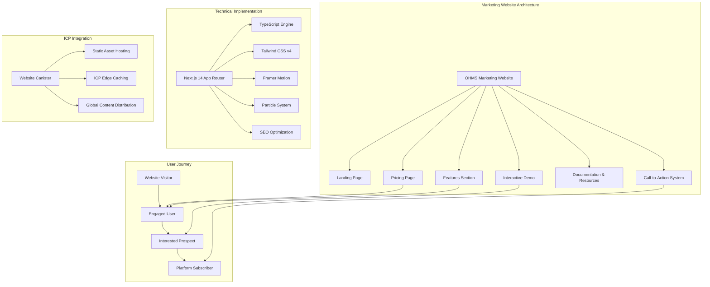
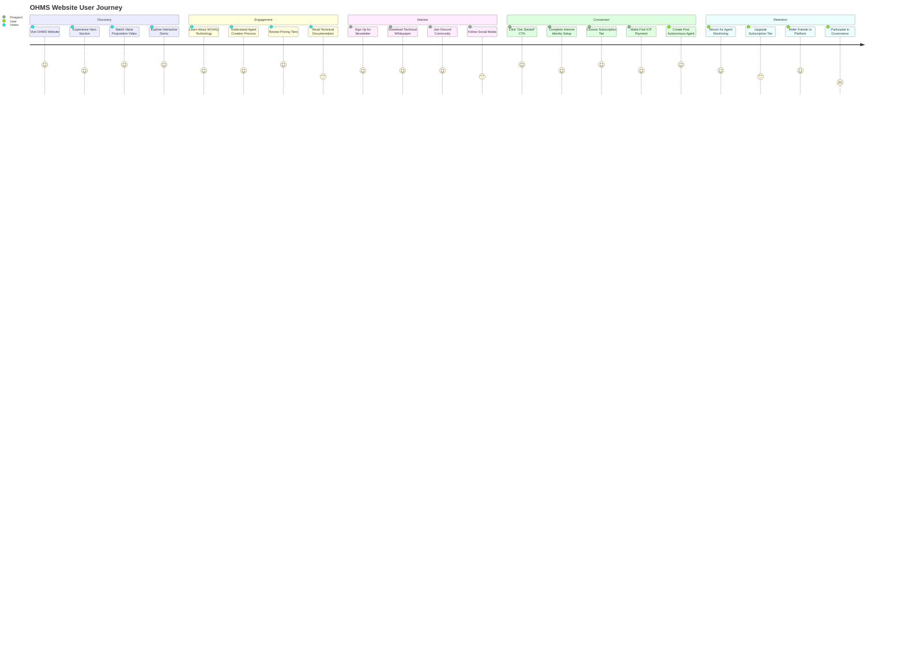
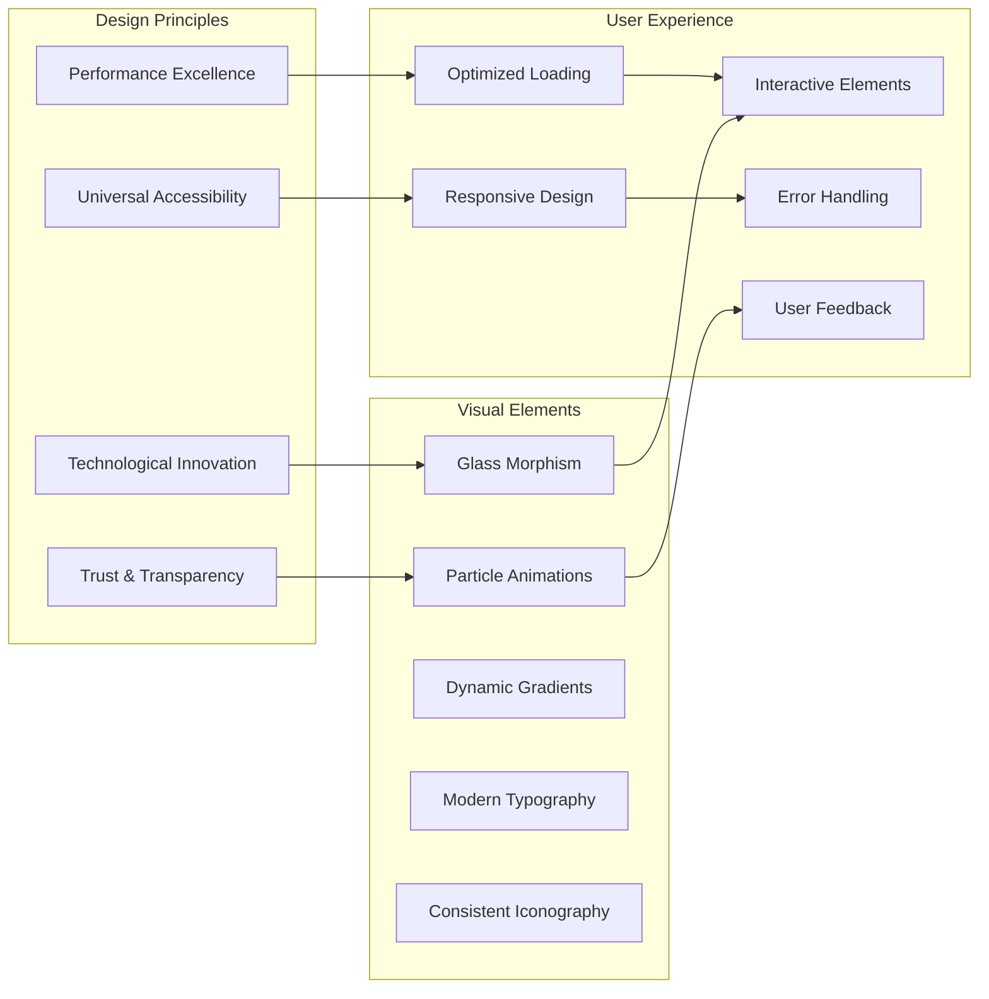
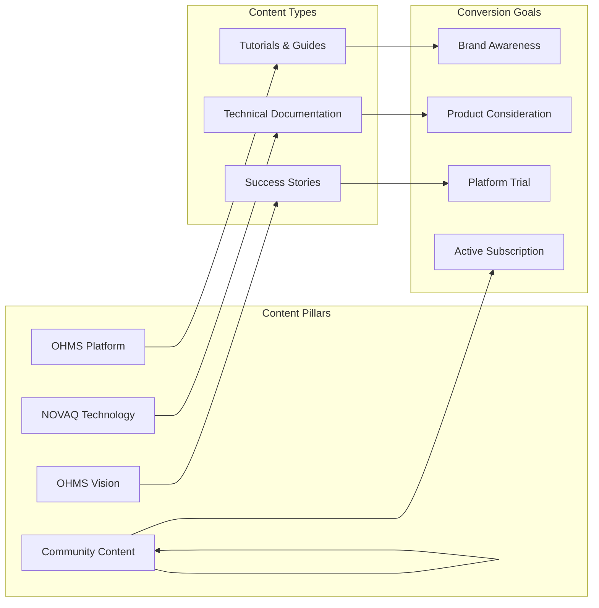
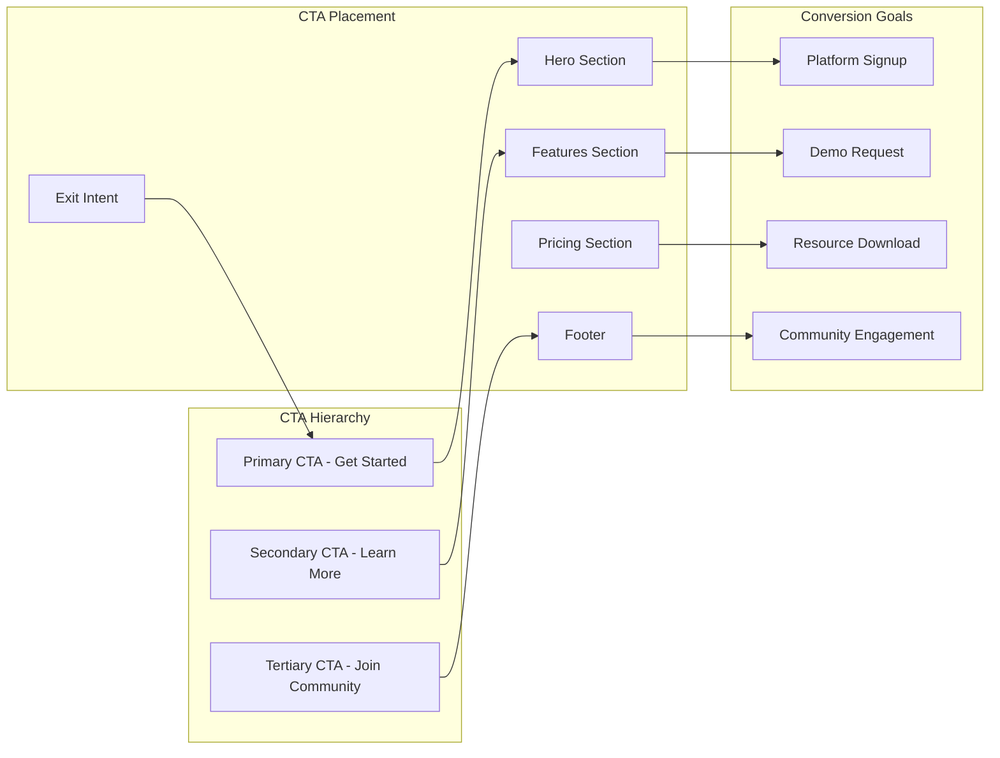

# OHMS Website - Revolutionary AI Agent Platform Showcase

[](https://github.com/ohms-2-0)
[](https://nextjs.org/)
[](https://www.typescriptlang.org/)
[](https://tailwindcss.com/)
[](https://internetcomputer.org/)

**Canister ID:** `rjeaj-jyaaa-aaaau-abyka-cai`
**Network:** Internet Computer Mainnet
**Direct URL:** https://rjeaj-jyaaa-aaaau-abyka-cai.icp0.io/

The OHMS Website is the stunning marketing and informational platform that introduces the world to the revolutionary OHMS 2.0 autonomous agent ecosystem. Built with cutting-edge web technologies and deployed entirely on the Internet Computer, this website showcases the future of decentralized AI agent creation.

## 🎯 Mission

Create an exceptional marketing experience that:
- **Showcases** the revolutionary OHMS 2.0 autonomous agent platform
- **Educates** visitors about the power of instruction-based AI creation
- **Converts** interested users into active OHMS platform subscribers
- **Demonstrates** the technical innovation behind NOVAQ compression
- **Communicates** the vision of democratized, on-chain AI intelligence

## 🏗️ Architecture Overview



## 🚀 User Journey & Conversion Funnel



## 🎨 Design System & User Experience

### Visual Design Philosophy



### Key Visual Components

- **Hero Section**: Immersive particle background with compelling value proposition
- **Feature Grid**: Interactive showcase of OHMS capabilities with hover effects
- **Demo Section**: Embedded interactive agent creation simulation
- **Pricing Cards**: Transparent pricing with clear feature comparisons
- **Technology Showcase**: Visual explanation of NOVAQ compression technology
- **Social Proof**: Community testimonials and adoption metrics

## 📊 Performance & Technical Excellence

### Core Web Vitals Optimization

| Metric | Target | Status | Implementation |
|--------|--------|--------|----------------|
| **LCP** (Largest Contentful Paint) | <2.5s | ✅ | Image optimization, lazy loading, efficient fonts |
| **FID** (First Input Delay) | <100ms | ✅ | Code splitting, minimal JavaScript, efficient animations |
| **CLS** (Cumulative Layout Shift) | <0.1 | ✅ | Reserved space for dynamic content, stable layouts |
| **TTI** (Time to Interactive) | <3s | ✅ | Progressive loading, optimized bundles |
| **FCP** (First Contentful Paint) | <1.8s | ✅ | Critical CSS, optimized assets |

### Technical Optimizations

```typescript
// Next.js Configuration for ICP Deployment
// next.config.ts
import type { NextConfig } from 'next';

const nextConfig: NextConfig = {
  output: 'export',
  trailingSlash: true,
  images: {
    unoptimized: true, // Required for ICP deployment
    formats: ['image/webp', 'image/avif'],
  },
  experimental: {
    optimizePackageImports: ['lucide-react', 'framer-motion'],
  },
  compiler: {
    removeConsole: process.env.NODE_ENV === 'production',
  },
  // ICP-specific optimizations
  assetPrefix: process.env.NODE_ENV === 'production' ? undefined : undefined,
};

export default nextConfig;
```

### Bundle Analysis & Optimization

```typescript
// Bundle optimization configuration
const withBundleAnalyzer = require('@next/bundle-analyzer')({
  enabled: process.env.ANALYZE === 'true',
});

module.exports = withBundleAnalyzer({
  webpack: (config, { dev }) => {
    if (!dev) {
      // Production optimizations
      config.optimization.splitChunks.chunks = 'all';
      config.optimization.splitChunks.cacheGroups = {
        vendor: {
          test: /[\\/]node_modules[\\/]/,
          name: 'vendors',
          chunks: 'all',
        },
        ui: {
          test: /[\\/]components[\\/]ui[\\/]/,
          name: 'ui-components',
          chunks: 'all',
        },
      };
    }
    return config;
  },
});
```

## 🔧 Technology Stack & Architecture

### Core Technologies

| Component | Technology | Version | Purpose | Rationale |
|-----------|------------|---------|---------|-----------|
| **Framework** | Next.js | 14.x | React framework with App Router | Full-stack capabilities, optimal performance |
| **Language** | TypeScript | 5.0+ | Type-safe development | Enhanced DX, runtime error prevention |
| **Styling** | Tailwind CSS | 4.x | Utility-first CSS framework | Rapid UI development, consistent design |
| **Animations** | Framer Motion | 11.x | Animation library | Smooth, performant animations |
| **Particles** | tsParticles | 3.x | Particle system | Immersive visual effects |
| **Icons** | Lucide React | 0.300+ | Icon library | Consistent, accessible iconography |
| **Deployment** | ICP Canister | - | Decentralized hosting | True decentralization, global CDN |
| **Analytics** | Custom ICP Analytics | - | User behavior tracking | Privacy-preserving analytics |

### ICP-Specific Optimizations

```typescript
// ICP Asset Configuration
// .ic-assets.json5
{
  "fields": [
    {
      "name": "index.html",
      "asset": "index.html",
      "folder": "dist",
      "filename": "index.html",
      "headers": {
        "Content-Type": "text/html",
        "Cache-Control": "public, max-age=31536000, immutable"
      }
    },
    {
      "name": "styles",
      "match": "*.css",
      "headers": {
        "Content-Type": "text/css",
        "Cache-Control": "public, max-age=31536000, immutable"
      }
    },
    {
      "name": "scripts",
      "match": "*.js",
      "headers": {
        "Content-Type": "application/javascript",
        "Cache-Control": "public, max-age=31536000, immutable"
      }
    },
    {
      "name": "images",
      "match": "*.{png,jpg,jpeg,webp,avif,svg}",
      "headers": {
        "Content-Type": "image/*",
        "Cache-Control": "public, max-age=31536000, immutable"
      }
    }
  ]
}
```

## 📱 Responsive Design & Mobile Experience

### Breakpoint Strategy

```scss
// Tailwind CSS Custom Breakpoints
$screens: (
  'xs': '475px',
  'sm': '640px',
  'md': '768px',
  'lg': '1024px',
  'xl': '1280px',
  '2xl': '1536px',
  '3xl': '1920px',
);

// Mobile-first responsive utilities
.mobile-menu {
  @apply fixed inset-0 z-50 bg-background/95 backdrop-blur-sm;
}

.hero-content {
  @apply px-4 py-8 sm:px-6 sm:py-12 lg:px-8 lg:py-16;
}
```

### Mobile Optimization Features

- **Touch-Friendly Interactions**: Minimum 44px touch targets
- **Optimized Animations**: Reduced motion for mobile performance
- **Efficient Images**: WebP/AVIF with responsive sizing
- **Progressive Loading**: Critical content first, enhancements later
- **Offline Capability**: Service worker for basic offline functionality

## 🔍 SEO & Content Strategy

### SEO Optimization Implementation

```typescript
// Metadata configuration for each page
export const metadata: Metadata = {
  title: 'OHMS 2.0 - Revolutionary Autonomous AI Agent Platform',
  description: 'Transform natural language instructions into autonomous AI agents. Experience the future of decentralized AI with NOVAQ compression and on-chain intelligence.',
  keywords: ['AI', 'autonomous agents', 'decentralized AI', 'Internet Computer', 'NOVAQ', 'machine learning'],
  authors: [{ name: 'OHMS Team' }],
  creator: 'OHMS',
  publisher: 'OHMS',
  formatDetection: {
    email: false,
    address: false,
    telephone: false,
  },
  metadataBase: new URL('https://rjeaj-jyaaa-aaaau-abyka-cai.icp0.io'),
  alternates: {
    canonical: '/',
  },
  openGraph: {
    title: 'OHMS 2.0 - Autonomous AI Agent Platform',
    description: 'Create autonomous AI agents from natural language instructions. Revolutionary NOVAQ compression enables on-chain AI intelligence.',
    url: 'https://rjeaj-jyaaa-aaaau-abyka-cai.icp0.io',
    siteName: 'OHMS',
    images: [
      {
        url: '/og-image.jpg',
        width: 1200,
        height: 630,
        alt: 'OHMS 2.0 Platform Preview',
      },
    ],
    locale: 'en_US',
    type: 'website',
  },
  twitter: {
    card: 'summary_large_image',
    title: 'OHMS 2.0 - Autonomous AI Agent Platform',
    description: 'Transform natural language into autonomous AI intelligence. Experience the future of decentralized AI.',
    images: ['/twitter-image.jpg'],
    creator: '@ohms_ai',
  },
  robots: {
    index: true,
    follow: true,
    googleBot: {
      index: true,
      follow: true,
      'max-video-preview': -1,
      'max-image-preview': 'large',
      'max-snippet': -1,
    },
  },
  verification: {
    google: 'google-site-verification-code',
    yandex: 'yandex-verification-code',
    yahoo: 'yahoo-site-verification-code',
  },
};
```

### Content Strategy



## 🚀 Deployment & Operations

### ICP Deployment Strategy

```bash
# Build optimized static export
npm run build
npm run export

# Deploy to ICP mainnet
dfx deploy --network ic ohms_website

# Verify deployment
curl -I https://rjeaj-jyaaa-aaaau-abyka-cai.icp0.io/

# Check canister cycles
dfx canister --network ic status rjeaj-jyaaa-aaaau-abyka-cai
```

### Performance Monitoring

```typescript
// Performance monitoring implementation
export const usePerformanceMonitor = () => {
  useEffect(() => {
    // Core Web Vitals tracking
    if (typeof window !== 'undefined') {
      import('web-vitals').then(({ getCLS, getFID, getFCP, getLCP, getTTFB }) => {
        getCLS(console.log);
        getFID(console.log);
        getFCP(console.log);
        getLCP(console.log);
        getTTFB(console.log);
      });
    }
  }, []);

  return null;
};
```

## 📊 Analytics & User Insights

### Privacy-Preserving Analytics

```typescript
// ICP-based analytics (privacy-preserving)
export const useAnalytics = () => {
  const trackEvent = async (eventName: string, properties: Record<string, any>) => {
    try {
      // ICP canister call for analytics
      await fetch('/api/analytics', {
        method: 'POST',
        headers: {
          'Content-Type': 'application/json',
        },
        body: JSON.stringify({
          event: eventName,
          properties,
          timestamp: Date.now(),
          // No personal identifiable information
        }),
      });
    } catch (error) {
      console.error('Analytics error:', error);
    }
  };

  return { trackEvent };
};
```

## 🎯 Conversion Optimization

### Call-to-Action Strategy



## 🌐 Internationalization & Localization

### Multi-Language Support

```typescript
// Internationalization configuration
const i18n = {
  defaultLocale: 'en',
  locales: ['en', 'es', 'fr', 'de', 'zh', 'ja'],
  localeDetection: true,
};

export default i18n;

// Localized content structure
export const content = {
  en: {
    hero: {
      title: 'Transform Instructions into Autonomous AI Intelligence',
      subtitle: 'Create sophisticated AI agents from natural language. Experience the future of decentralized AI.',
    },
    features: {
      title: 'Revolutionary Capabilities',
      items: [
        {
          title: 'Natural Language Agent Creation',
          description: 'Transform text instructions into autonomous AI agents in seconds.',
        },
        // ... more features
      ],
    },
  },
  // Other languages...
};
```

## 📋 Success Metrics

### Marketing Success
- **Website Traffic**: 10,000+ monthly visitors
- **Conversion Rate**: >5% visitor to platform signup
- **Time on Page**: >3 minutes average session duration
- **Bounce Rate**: <30% for key landing pages
- **SEO Rankings**: Top 10 for "autonomous AI agents"

### Technical Success
- **Core Web Vitals**: All metrics meet or exceed targets
- **Global Performance**: <2s load time worldwide
- **Mobile Experience**: >95% mobile usability score
- **Accessibility**: WCAG AA compliance
- **SEO Performance**: >90% crawlability and indexability

## 🎯 Future Roadmap

### Planned Enhancements
- **Multi-Language Support**: Complete internationalization
- **Interactive Product Tour**: Guided platform demonstration
- **Advanced Analytics**: Predictive user behavior analysis
- **A/B Testing Framework**: Data-driven optimization
- **Progressive Web App**: Native app-like experience
- **AI-Powered Personalization**: Dynamic content based on user interests

## 📞 Support & Resources

### Documentation
- [OHMS Platform Documentation](https://docs.ohms.ai/)
- [Technical Whitepaper](https://docs.ohms.ai/whitepaper)
- [Developer Resources](https://docs.ohms.ai/developers)

### Community
- [OHMS Discord](https://discord.gg/ohms)
- [GitHub Repository](https://github.com/ohms-2-0/ohms-website)
- [ICP Community Forum](https://forum.dfinity.org/)

---

**OHMS Website**: Showcasing the revolutionary future of autonomous AI agents, built and deployed entirely on the Internet Computer. 🚀
