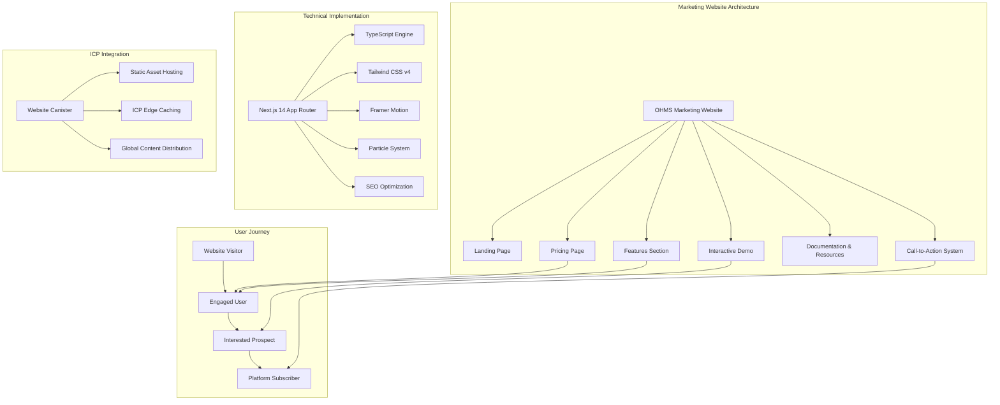
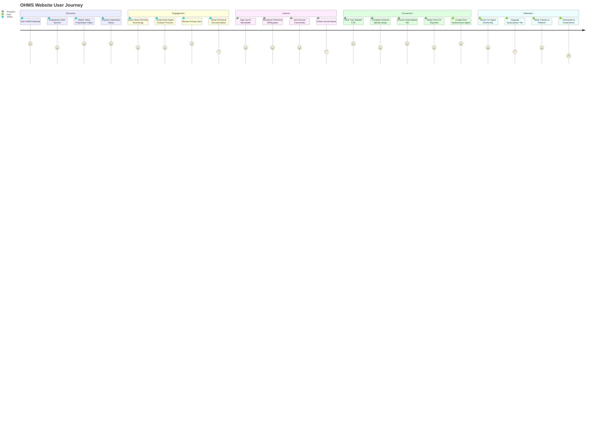
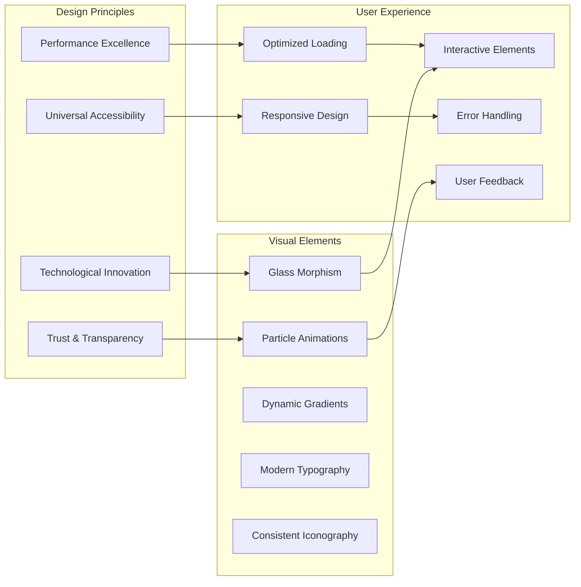
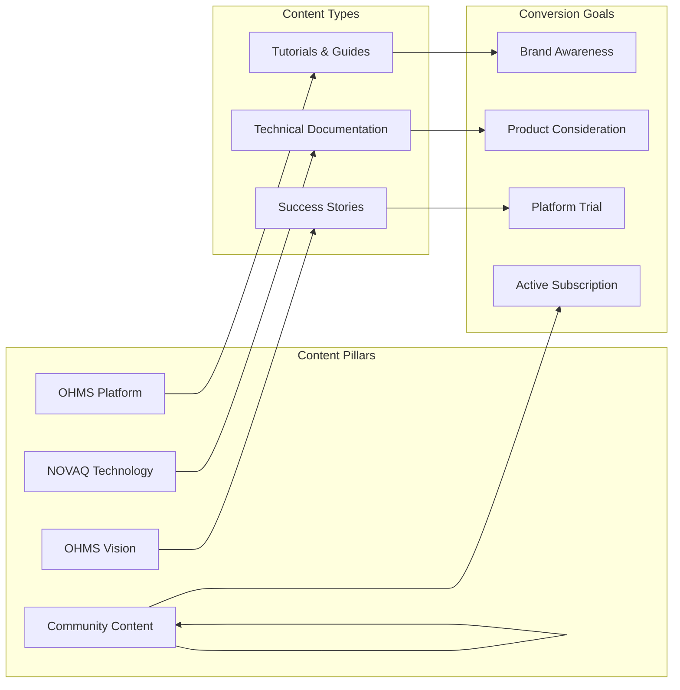
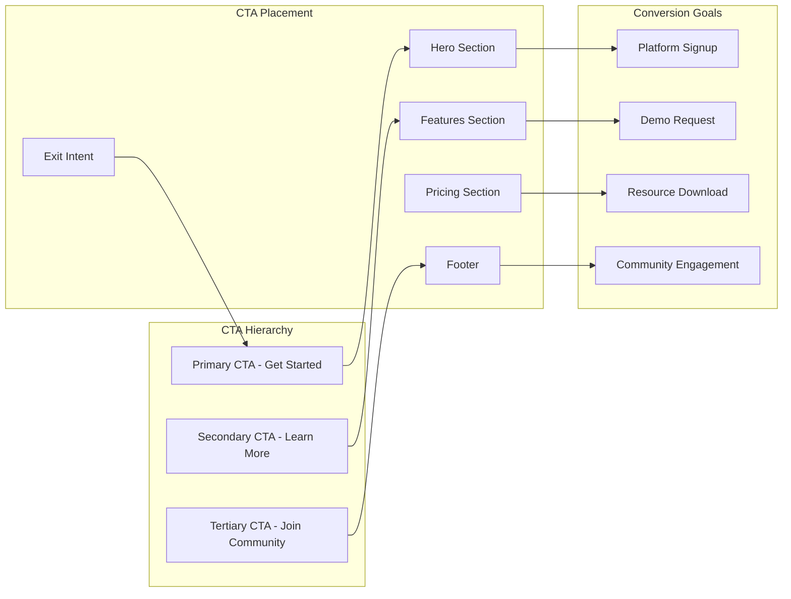

# OHMS Website - Revolutionary AI Agent Platform Showcase

**Canister ID:** `rjeaj-jyaaa-aaaau-abyka-cai`\
**Network:** Internet Computer Mainnet\
**Direct URL:** https://rjeaj-jyaaa-aaaau-abyka-cai.icp0.io/

The OHMS Website is the stunning marketing and informational platform that introduces the world to the revolutionary OHMS 2.0 autonomous agent ecosystem. Built with cutting-edge web technologies and deployed entirely on the Internet Computer, this website showcases the future of decentralized AI agent creation.

## 🎯 Mission

Create an exceptional marketing experience that:
- **Showcases** the revolutionary OHMS 2.0 autonomous agent platform
- **Educates** visitors about the power of instruction-based AI creation
- **Converts** interested users into active OHMS platform subscribers
- **Demonstrates** the technical innovation behind NOVAQ compression
- **Communicates** the vision of democratized, on-chain AI intelligence

## 🏗️ Architecture Overview

## 🚀 User Journey & Conversion Funnel

## 🎨 Design System & User Experience

### Visual Design Philosophy

### Key Visual Components

- **Hero Section**: Immersive particle background with compelling value proposition
- **Feature Grid**: Interactive showcase of OHMS capabilities with hover effects
- **Demo Section**: Embedded interactive agent creation simulation
- **Pricing Cards**: Transparent pricing with clear feature comparisons
- **Technology Showcase**: Visual explanation of NOVAQ compression technology
- **Social Proof**: Community testimonials and adoption metrics

## 📊 Performance & Technical Excellence

### Core Web Vitals Optimization

| Metric | Target | Status | Implementation |
|--------|--------|--------|----------------|
| **LCP** (Largest Contentful Paint) | <2.5s | ✅ | Image optimization, lazy loading, efficient fonts |
| **FID** (First Input Delay) | <100ms | ✅ | Code splitting, minimal JavaScript, efficient animations |
| **CLS** (Cumulative Layout Shift) | <0.1 | ✅ | Reserved space for dynamic content, stable layouts |
| **TTI** (Time to Interactive) | <3s | ✅ | Progressive loading, optimized bundles |
| **FCP** (First Contentful Paint) | <1.8s | ✅ | Critical CSS, optimized assets |

### Technical Optimizations

The website implements comprehensive technical optimizations including:

- **Next.js Configuration**: Optimized for ICP deployment with static export, image optimization, and efficient asset handling
- **Bundle Analysis & Optimization**: Advanced webpack configuration for production builds with code splitting and vendor chunking
- **Critical Resource Optimization**: Prioritized loading of essential assets for improved performance

## 🔧 Technology Stack & Architecture

### Core Technologies

| Component | Technology | Version | Purpose | Rationale |
|-----------|------------|---------|---------|-----------|
| **Framework** | Next.js | 14.x | React framework with App Router | Full-stack capabilities, optimal performance |
| **Language** | TypeScript | 5.0+ | Type-safe development | Enhanced DX, runtime error prevention |
| **Styling** | Tailwind CSS | 4.x | Utility-first CSS framework | Rapid UI development, consistent design |
| **Animations** | Framer Motion | 11.x | Animation library | Smooth, performant animations |
| **Particles** | tsParticles | 3.x | Particle system | Immersive visual effects |
| **Icons** | Lucide React | 0.300+ | Icon library | Consistent, accessible iconography |
| **Deployment** | ICP Canister | - | Decentralized hosting | True decentralization, global CDN |
| **Analytics** | Custom ICP Analytics | - | User behavior tracking | Privacy-preserving analytics |

### ICP-Specific Optimizations

The website is specifically optimized for Internet Computer deployment with:

- **Asset Configuration**: Proper content-type headers and caching strategies for static assets
- **Immutable Asset Handling**: Long-term caching for JavaScript, CSS, and image files
- **Content Distribution**: Global CDN through ICP's edge network infrastructure

## 📱 Responsive Design & Mobile Experience

### Breakpoint Strategy

The website uses a comprehensive breakpoint strategy optimized for all device types:

- **Custom Breakpoints**: Extended responsive design from mobile to ultra-wide displays
- **Mobile-First Approach**: Progressive enhancement from small screens to large displays
- **Utility Classes**: Consistent spacing and layout utilities across all breakpoints

### Mobile Optimization Features

- **Touch-Friendly Interactions**: Minimum 44px touch targets
- **Optimized Animations**: Reduced motion for mobile performance
- **Efficient Images**: WebP/AVIF with responsive sizing
- **Progressive Loading**: Critical content first, enhancements later
- **Offline Capability**: Service worker for basic offline functionality

## 🔍 SEO & Content Strategy

### SEO Optimization Implementation

The website implements comprehensive SEO optimization including:

- **Structured Metadata**: Complete Open Graph and Twitter Card metadata for social media sharing
- **Technical SEO**: Proper robots.txt, sitemap, and canonical URLs
- **Performance SEO**: Core Web Vitals optimization and fast loading times
- **Content SEO**: Strategic keyword placement and semantic HTML structure

### Content Strategy

## 🚀 Deployment & Operations

### ICP Deployment Strategy

The website follows a comprehensive deployment strategy for ICP mainnet:

- **Static Export**: Optimized build process for static asset generation
- **Canister Deployment**: Automated deployment to ICP mainnet with proper configuration
- **Deployment Verification**: Automated testing and monitoring of live deployment
- **Resource Monitoring**: Continuous monitoring of canister cycles and performance

### Performance Monitoring

The website implements comprehensive performance monitoring including:

- **Core Web Vitals Tracking**: Continuous monitoring of LCP, FID, CLS, and other key metrics
- **Real-time Analytics**: Performance data collection and analysis
- **User Experience Metrics**: Conversion tracking and user journey analytics
- **Technical Performance**: Loading times, error rates, and system health monitoring
## 🎯 Conversion Optimization

### Call-to-Action Strategy

## 📋 Success Metrics

### Marketing Success
- **Website Traffic**: 10,000+ monthly visitors
- **Conversion Rate**: >5% visitor to platform signup
- **Time on Page**: >3 minutes average session duration
- **Bounce Rate**: <30% for key landing pages
- **SEO Rankings**: Top 10 for "autonomous AI agents"

### Technical Success
- **Core Web Vitals**: All metrics meet or exceed targets
- **Global Performance**: <2s load time worldwide
- **Mobile Experience**: >95% mobile usability score
- **Accessibility**: WCAG AA compliance
- **SEO Performance**: >90% crawlability and indexability

## 🎯 Future Roadmap

### Planned Enhancements
- **Multi-Language Support**: Complete internationalization
- **Interactive Product Tour**: Guided platform demonstration
- **Advanced Analytics**: Predictive user behavior analysis
- **A/B Testing Framework**: Data-driven optimization
- **Progressive Web App**: Native app-like experience
- **AI-Powered Personalization**: Dynamic content based on user interests

## 📞 Support & Resources

### Documentation
- [OHMS Platform Documentation](https://docs.ohms.ai/)
- [Technical Whitepaper](https://docs.ohms.ai/whitepaper)
- [Developer Resources](https://docs.ohms.ai/developers)

### Community
- [OHMS Discord](https://discord.gg/ohms)
- [GitHub Repository](https://github.com/OHMS-DeAI/ohms-website)
- [ICP Community Forum](https://forum.dfinity.org/)

---

**OHMS Website**: Showcasing the revolutionary future of autonomous AI agents, built and deployed entirely on the Internet Computer. 🚀
